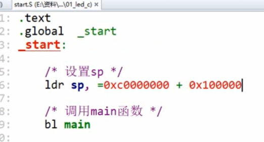
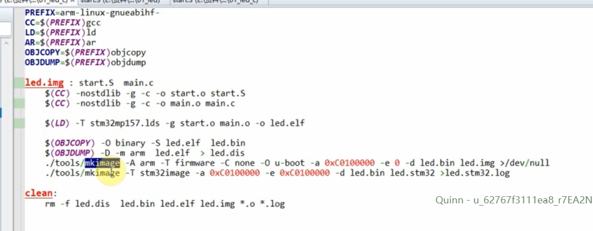
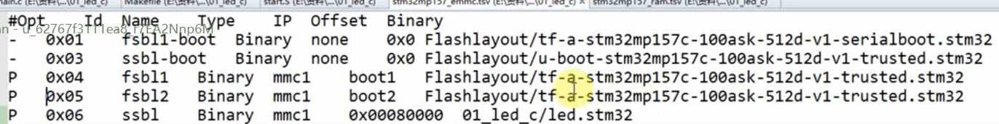
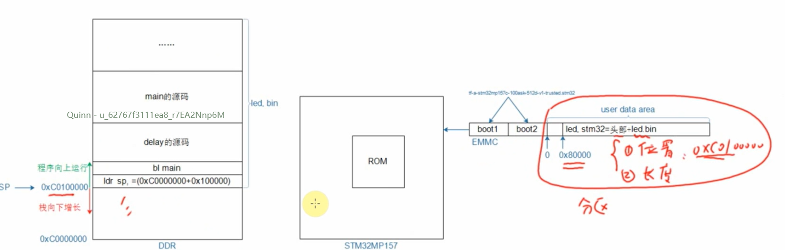
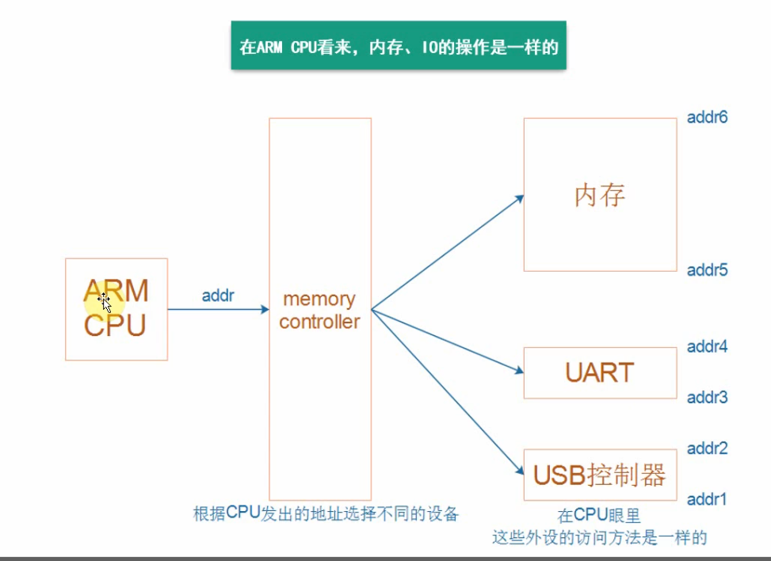
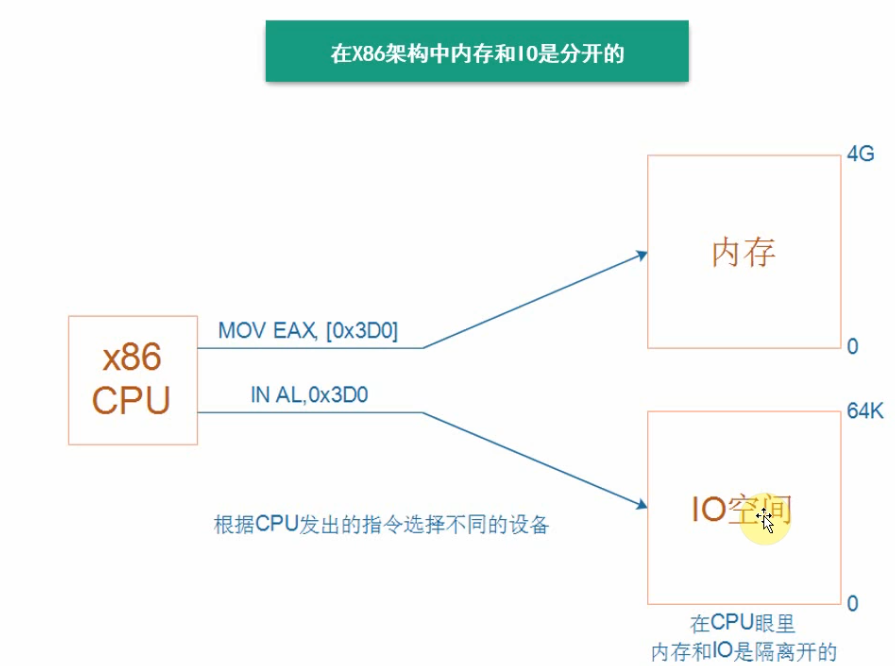
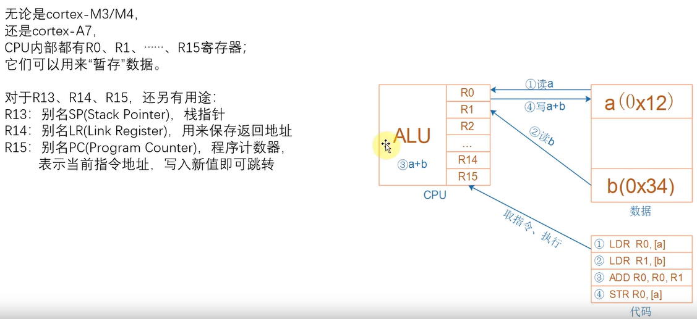
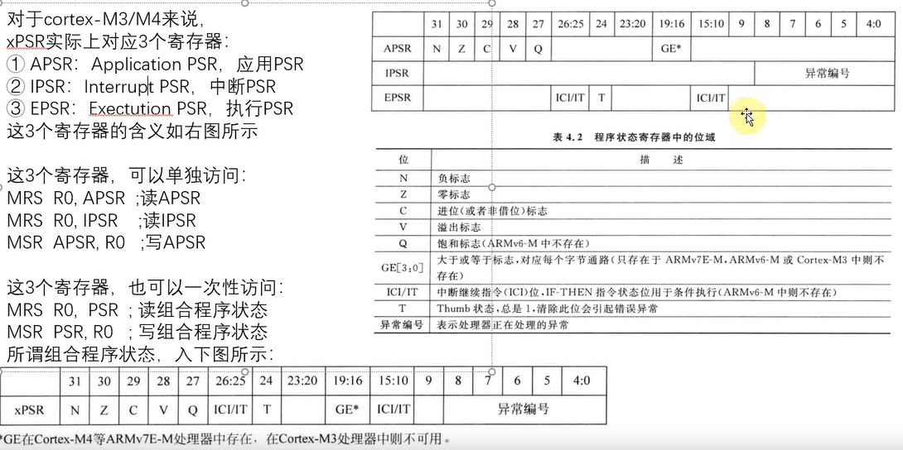
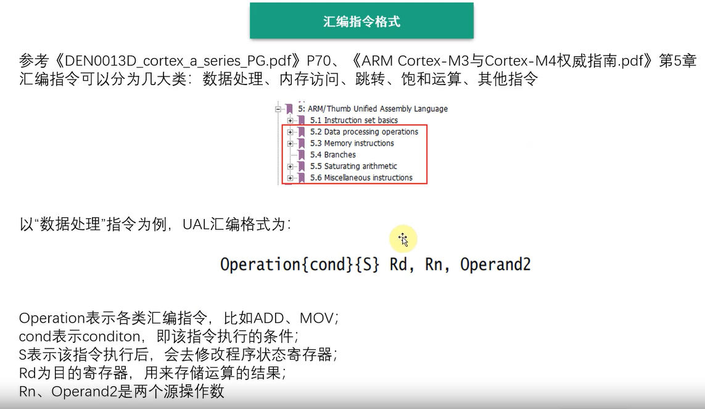

#                                                               ARM架构及编程

# 嵌入式概念及硬件组成

## 处理器的区分

CPU (MPU)->专用 CPU(个人电脑)

CPU (MPU)->MCU->AP(手机、能运行linux的设备)

- MPU 和 MCU 的区别？

  **CPU**主要由**运算器**、**控制器**、**寄存器组**和**内部总线**等构成

  **控制器**由程序计数器（PC，Program Counter）、指令寄存器（IR，Instruction Register）、指令译码器（ID，Instruction Decoder）、时序产生器（Timing Generator）、操作控制器（Control Unit）组成。整个控制器的运行逻辑是先按照**程序计数器**所指出的指令地址，从内存中取出一条指令到**指令寄存器IR**，然后**指令译码器ID**对指令进行分析，之后**操作控制器**根据指令的功能向有关部件发出控制命令，执行控制指令的操作。完成操作之后，**程序计数器**加1，再重复执行上述操作。

  **运算器**一般最少包括3个**寄存器**和1个**算术逻辑单元(ALU)**

  **寄存器**是一种有限存储容量的高速存储部件，可用来暂存指令、数据和位址。寄存器有很多种类。由在CPU中至少要有六类：指令寄存器（IR）、程序计数器（PC）、地址寄存器（AR）、数据寄存器（DR）、累加寄存器（AC）、程序状态字寄存器（PSW）。这些寄存器用来暂存一个计算机字，其数目可以根据需要进行扩充。

  **MCU**(Micro Controller Unit)，又称单片微型计算机(Single Chip Microcomputer)，简称单片机，是指随着大规模集成电路的出现及其发展，将计算机的CPU、RAM、ROM、定时器和多种I/O接口集成在一片芯片上，形成芯片级的计算机。

  > **MPU** (Micro Processor Unit)，叫微处理器(不是微控制器MCU，很多人会把微处理器和微控制器混淆)，通常代表一个功能强大的CPU(暂且理解为增强版的CPU吧),但不是为任何已有的特定计算目的而设计的芯片。这种芯片往往是个人计算机和高端工作站的核心CPU。例如Intel 的X86，ARM的一些Cortex-A芯片。
  >
  > **SoC**(System on Chip，整体的一个电路系统，完成一个具体功能的东西)：指的是片上系统，MCU只是芯片级的芯片，而SoC是系统级的芯片，它既MCU那样有内置RAM、ROM同时又像MPU那样强大，不单单是放简单的代码，可以放系统级的代码，也就是说可以运行操作系统（以Linux OS为主）(将就认为是MCU集成化与MPU强处理力各优点二合一)。

## 嵌入式系统硬件组成

MCU 

Memory controller

非XIP设备（spi、LCD、SD、USB）

XIP：ROM、RAM、

> XIP：execute in place，即芯片内执行，指应用程序可以直接在flash闪存中取指然后译码、执行，不必再把代码读到系统RAM中，flash内执行时指Nor flash不需要初始化，可以直接在flash内执行代码，但往往只执行部分代码，比如用于初始化RAM等。
>
> Nand Flash 和 Nor Flash：**Nor Flash能在芯片内执行，指的是CPU能够直接从Nor flash中取指令，供后面的译码器和执行器来使用。**

# 硬件知识

直接接二极管：芯片驱动能力够

经过三极管接发光二极管：芯片驱动能力不足 

不关心主芯片输出电平，只关心主芯片输出的逻辑状态

# LED编程

.text 表示后面部

分是处于代码段

.global 表示start是全局

> P表示会烧写，Offset表示烧到哪个位置。

> 上电后，固件里面有程序，会把boot1/2分区里面的程序读出来到内存中运行，boot1/2的程序去初始化硬件，接着boot1/2的程序把user data area里面的程序读到ram中对应位置	

DDR

> 全称为Double Data Rate SDRAM，中文名为“双倍数据流SDRAM”。DDR SDRAM在原有的SDRAM的基础上改进而来。   

EMMC包括Flash

# 地址空间

- ARM

  CPU对于内存只有读和写操作，运算在内部，

  CPU只能直接控制片上外设，这些片上外设位于一个地址空间，片外的外设如外接的flash则位于另一个地址空间

  

- X86

## ARM内部寄存器

运行a+b指令时，cpu的运行过程

M3/M4架构的XPSR实际上对应3个寄存器APSR/IPSR/EPSR

这些程序状态寄存器，保留某些比较结果

# 汇编指令格式

指令集：arm thumb thumb2

MOV 寄存器之间传递数据，或者传递立即数（LDR只能传递常数（不超过32位的数））

STR 往内存写数据

LDR 从内存读数据