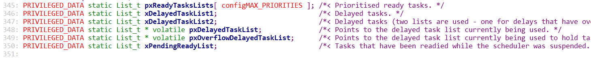
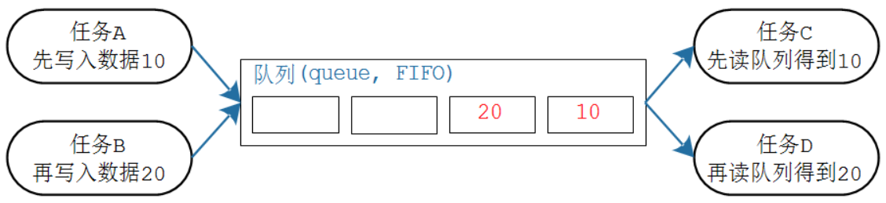
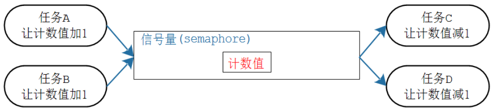
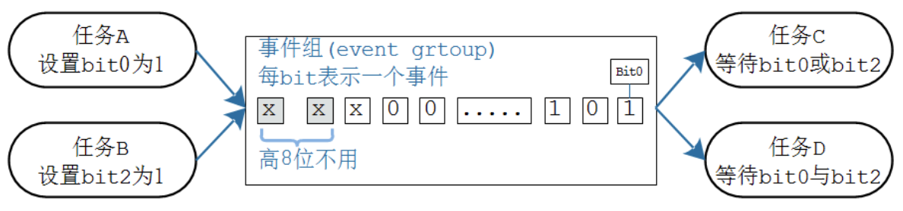
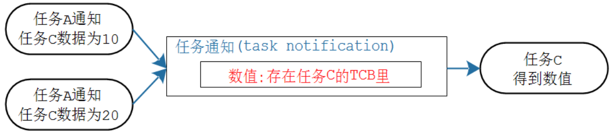

# Freertos学习

## 裸机开发模式

- 轮询方式

  一个while循环

  缺点：函数之间相互有影响，会被互相阻塞

- 事件驱动(前后台)

  事件发生时，调用对应函数

  缺点：

  - 中断处理时间过长且优先级高的程序会对其他程序有影响
  - 同一时间只能处理一个函数，其它中断可能丢失

- 改进的事件驱动

  触发中断后，设置标志位，主循环检测到标志位之后才进行中断处理函数。保证中断不会丢失

  缺点：

  - 中断持续触发后的话，任务间会相互阻塞。

- 时间驱动方式：定时器

  定时器方式在最大运行时间、实时响应指标都确定的情况下，人为的将他们安排在时间轴上，相对于前后台更为准确。在没有RTOS前，使用这种方式。

  > 最大运行时间：一个函数从开始执行到结束的最长时间
  >
  > 实时响应指标：要求函数做出响应的最长时间周期

  设置一个定时器，比如每1ms产生一次中断

  对于函数A，可以设置它的执行周期，比如每1ms执行一次

  对于函数B，可以设置它的执行周期，比如每2ms执行一次

  对于函数C，可以设置它的执行周期，比如每3ms执行一次

  ```c
  
  typedef struct soft_timer{
  	int remain;//表示剩余多少时间，就需要调用下面的函数
  	int period;//表示周期
  	void (*function)(void);//处理函数
  }soft_timer,*p_soft_timer;
  
  static soft_timer timers[]={
  	{1,1,A},
      {2,2,B},
      {3,3,C}
  };//符合题目要求
  
  void main(){
  	while(1){
  	}
  }
  void timer_isr(){
  	int i;//是每个timers数组成员的remain都减1.
  	for(i=0;i<3;i++){
  		timers[i].remain--;
  	}
  //当remain减到0，就表示要调用对应结构体中的函数了
  	for(i=0;i<3;i++){
  		if(timers[i].remain==0){
  			timers[i].function();//调用函数
  			timers[i].remain=timers[i].period;//重置remain.
  		}
  	}
  }
  ```

  缺点：

  - function()的执行过长的话，会影响其他函数的调用
  - 延误整个时间基准

- 改进的时间驱动

  将任务函数的判断与执行放到主函数中，保证时基
  缺点：函数执行过长的话会阻塞其他任务

- 状态机

  以上方式在面对函数时间处理特别长的情况下都会造成不同程度的影响，为了减轻这种影响，我们可以人为的将一段函数拆分成若干段，每次执行其中的一段，执行结束后立即跳出，检测是否有其他更高优先级的任务去做，如果有优先执行，如果没有，从离开的地方继续执行被分段的函数
  代码如下：

  ```c
  /*****更改前*****/
  	void A()
  	{
  		//函数A执行需要特别长的时间
  	}
  int main()
  {	
  	while(1)
  	{
  		A();	
  	}
  }
  
  /*****更改后*****/
  void A()
  {
  	static int state = 0;
  	switch(state)
  	{
  		case 0:
  				A1();
  				state++;
  				return;
  		case 1:
  				A2();
  				state++;
  				return;
  		...
  	}
  }
  
  int main()
  {
  	while(1)
  	{
  		A();
          B();
          ...
  	}
  }
  ```

  缺点：在状态机思想的编程模式下，单片机系统可以获得一个更为优异的性能。
  但是在实际编程过程中，每个函数的拆分需要实际的软硬件调试，需要经验且效率较低。

- RTOS的功能之一是将任务进行时间片轮转，以实现与状态机相同的效果，且编程方式简单。

## 栈

栈里面会放返回地址和局部变量，来一个新函数就会往下多占一段空间然后继续放新函数的返回地址和局部变量；

rtos中每个任务都有自己的栈

- 位操作

  第x位置1；

  num = num | 1 << n;

  第n位清0：

  num = num |~(0 << n)

  测试第n位：

  if(num & 1 << n)

  从第n位开始，取m位。num=（num|m个1<<n)>>n

## 堆

堆前面会有长度信息，要注意栈大小够不够 


## 任务的创建

- 动态 创建任务

  ```c
  BaseType_t xTaskCreate( TaskFunction_t pxTaskCode, // 函数指针, 任务函数
   const char * const pcName, // 任务的名字
   const configSTACK_DEPTH_TYPE usStackDepth, //栈大小,单位为 word,10 表示40 字节
   void * const pvParameters, // 调用任务函数时传入的参数
   UBaseType_t uxPriority, // 优先级
   TaskHandle_t * const pxCreatedTask ); // 任务句柄, 以后使用它来操作这个任务
  ```

- 静态创建任务（静态的话，TCB结构体要提前分配好，栈要提前分配好）

  xTaskCreateStatic()

## 任务状态


存在不同的状态链表

```c
vTaskDelayUntil( pxPreviousWakeTime, xTimeIncrement ); //从第一个参数的时间，延迟固定时间结束
```

```c
void vTaskDelay( const TickType_t xTicksToDelay); // 从结束到开始的固定延时
```

任务把自己杀掉，必须有空闲任务清理内存。

启动调度器时会帮你创建空闲任务

## 调度策略

调度策略：确定哪个就绪态的任务可以切换为运行状态。

- 抢占

- 时间片轮转

- 空闲任务是否礼让

## 队列

像一个传送带，先传送的先到达 ;

创建，写，读 以传递数值，消耗空间

创建：

```c
QueueHandle_t xQueueCreate( UBaseType_t uxQueueLength, UBaseType_t uxItemSize);
```

锁的实现

> 调用读队列函数（第三参数设置一直等待直到有数据可读），获得锁使用权，之后队列里面无数据，其他用户无法读到数据只能阻塞
>
> 再调用写队列消息函数释放使用权。（队列里面有数据表示别人可以读这个队列）

队列可以传递 指针（malloc，free） 字符 整型结构体等，通过定义不同类型的变量放入第二个参数来控制。

## 信号量

是一个计数值 （相比队列可以省空间，但是不能传递数值）

生产者让计数值++，消费者让信号量--，计数值为0时，消费者可以进入阻塞以等待。

分为：计数型和二进制型

用法 creat give take

## 互斥量

队列的问题：优先级继承、递归锁。互斥量可以解决

- 创建时发送一个1

- 自带优先级继承

- 但是无法解决谁持有，谁释放的问题

递归锁：

解决谁持有，谁释放的问题，非持有锁的人无法释放

## 事件组：

生产者任务可以设置某一个事件产生了 ，消费者可以等待一个或者多个任务

信号量同步这些可以减少cpu资源浪费

全局变量，一直检测 浪费资源

## 中断管理

用于ISR的API函数 如果发送不了，直接返回不阻塞、不进行函数调度(但记录)

## 资源管理

临界资源管理（互斥）

任务a和任务b都会用一个资源:开启任务之后就关闭任务调度，结束任务的时候恢复

- 任务a和中断b：在任务中屏蔽中断；

- 在中断中，记录中断状态，屏蔽中断，恢复中断状态


## FreeRTOS内部机制

# 一、任务的本质

任务就是运行中的函数(函数和它的栈)

栈用于保存切换任务时的现场

> 主任务的栈在启动文件里面设置，任务的栈在系统申请的大堆上 ***在.bss段上？？？？？***

- 任务被中断的三种情况及保存方式

  > 发生中断时，需要保护现场。
  >
  > 现场即被打断瞬间所有寄存器的值；保护方式，存进内存的栈中

  - 函数中断

    子函数可以不保存入参对应的几个寄存器(是调用函数传入，给子函数使用的寄存器)

  - 硬件中断

    硬件会保存一部分寄存器，软件只需要保存部分寄存器

  - 任务切换

    保存所有寄存器

  

# 二、创建任务的函数

## 2.1参数解析( 动态)

```c
        BaseType_t xTaskCreate( TaskFunction_t pxTaskCode,
                               const char * const pcName, 
                           	   const configSTACK_DEPTH_TYPE usStackDepth,
                               void * const pvParameters,
                               UBaseType_t uxPriority,
                               TaskHandle_t * const pxCreatedTask )
```

- 函数
  - 函数指针`pxTaskCode`
  - 任务名`pcName`
  -  调用函数时用的参数pvParameters

- 栈：用于任务切换，可以事先静态分配(比如使用数组)，也可以动态分配
  - 栈的深度`usStackDepth`

- 任务结构体：记录信息
  - 任务句柄(TCB结构体)保存xTaskCreate() 的输出结果`pxCreatedTask`
  - 任务的优先级`uxPriority`

### 2.1.1创建任务的结构体

```c
typedef struct tskTaskControlBlock     
{
    volatile StackType_t * pxTopOfStack; //执行栈里的最后一个元素
    ListItem_t xStateListItem;           //通过它把当前任务放入某个状态链表(Ready, Blocked, Suspended)       
    ListItem_t xEventListItem;           //比如任务在等待队列A，则通过xEventListItem把自己放入队列A的链表       
    UBaseType_t uxPriority;              //任务的原始优先级     
    StackType_t * pxStack;               //栈的起始位置       
    StackType_t * pxEndOfStack;          //栈顶，栈的最高的、有效地址
    UBaseType_t uxBasePriority;          //任务的当前优先级
    ......
} tskTCB;
```

在TCB_t里怎么没看到函数指针和参数？

初始化任务时，把函数指针存入了栈里。

## 2.2任务创建的过程

分配任务结构体

分配栈

初始化任务栈：写入函数地址， 参数


# 三、任务的调度机制(核心是链表)

## 3.1调度机制概述

* 优先级不同
  * 高优先级的任务，优先执行，可以抢占低优先级的任务
  * 高优先级的任务不停止，低优先级的任务永远无法执行
  * 同等优先级的任务，轮流执行：时间片轮转
* 状态
  * 运行态：running
  * 就绪态：ready
  * 阻塞：blocked，等待某件事(时间、事件)
  * 暂停：suspend，休息去了
* 怎么管理？
  * 怎么取出要运行的任务？
    * 找到最高优先级的运行态、就绪态任务，运行它
    * 如果大家平级，轮流执行：排队，链表前面的先运行，运行1个tick后乖乖地去链表尾部排队

## 3.2使用链表来管理任务



每个状态都有对应的链表，其中每个优先级，都有一个就绪链表：pxReadyTasksLists[优先级]，

任务被创建时，要使用`prvAddNewTaskToReadyList()`来把它放入对应的就绪链表。


## 3.3使用链表和TICK来进行时间片轮转

每一个TICK时间触发一次TICK中断。

FreeRTOS的为时间片轮转调度时：找优先级高的链表的任务运行，现存最高优先级链表存在多个任务就轮流运行一个Tick。

> 都是相同优先级任务的话，开启tick时间片轮转，每到一个tick时，在tick中断函数中会取出下一个任务，接着保存当前任务，恢复下一个任务的现场。
>
> 任务主动delay的情况下，会把任务从Ready链表移到Delay链表，之后每一个tick中断会去判断延迟时间有没有到，延迟时间到了，就把任务从从Delay链表移到Ready链表，接着进行任务调度


## 四、消息队列



```c
typedef struct QueueDefinition 
{
    int8_t * pcHead;           /*< Points to the beginning of the queue storage area. */
    int8_t * pcWriteTo;        /*< Points to the free next place in the storage area. */

    union
    {
        QueuePointers_t xQueue;     
        /*typedef struct QueuePointers
        {
        	int8_t * pcTail;     
    		int8_t * pcReadFrom;  
    	*/
        SemaphoreData_t xSemaphore;
} QueuePointers_t;
        
        */
        ...
    } u;

    List_t xTasksWaitingToSend;             /*< List of tasks that are blocked waiting to post onto this queue.  Stored in priority order. */
    List_t xTasksWaitingToReceive;          /*< List of tasks that are blocked waiting to read from this queue.  Stored in priority order. */
    ...
} xQUEUE;

typedef xQUEUE Queue_t;
```

创建消息队列的时：会有队列头`Queue_t`(包括读写指针和两个链表)和buffer

## 4.1核心是：关中断、环形缓冲区、链表

### 4.1.1互斥访问

> 保证数据的传输不会被破坏(不同任务访问冲突)队列的API内部已经实现了关调度的函数

在调用的消息队列API中关中断

```c
xQueueGenericSend(...){
    ...
    taskENTER_CRITICAL();
	...
}
```

### 4.1.2消息的存放

> 节省内存资源，能用更少的内存块做更多的事并且对内存的管理更加方便更加安全。

使用环形缓冲区

```c
#define LEN 5

int VAL[LEN];
int R = 0;
int W = 0;

int Read(){
	int result = VAL[R];
    R = (R + 1) % LEN ; 
	return result;
}

void Write(int num){
	VAL[W] = num;
    W = (W + 1) % LEN ; 
}
```

### 4.1.3 休眠唤醒

> 节省CPU资源

两链表：

- 写队列不成功而挂起
- 读队列不成功而挂起

```c
struct QueueDefinition{
    ...
    List_t xTasksWaitingToSend;   
    List_t xTasksWaitingToReceive;
    ...
}
```

## 4.2操作

### 4.1.1读过程：

1. 关中断
2. 检测有无data
   - 有data：跳到3
   - 无data：
     - 配置为不等待：返回error
     - 配置为等待：休眠
       1. 放入xTasksWaitingToReceive链表
       2. 将任务放入delay链表
3. (超时退出)
4. 有data
   1. 复制data
   2. 唤醒：xTasksWaitingToReceive链表中有任务时，唤醒xTasksWaitingToReceive链表中的第一个任务
      1. 将其从等待接收链表中移除
      2. 将该任务移入Ready链表

```c
xQueueReceive()
```

### 4.1.2写过程 

1. 关中断
2. 有无空间
   - 有空间：跳3有空间
   - 无空间：
     - 不等待：返回ERR
     - 等待：休眠
       1. 放入xTasksWaitingToSend链表
       2. 将任务放入Delay链表
3. (超时退出)
4. 有空间
   1. 写入dat
   2. 唤醒：xTasksWaitingToSend中有任务
      1. 从xTasksWaitingToSend链表中移除第一个任务
      2. 将该任务移入Ready状态链表中

### 4.1.3 超时

休眠过程中，唤醒有两种情况：1.有人写队列/有空间 2.超时

延时阻塞时，任务会有个xNextTaskUnblockTime值(xNextTaskUnblockTime 的值等于系统时基计数器的值 xTickCount 加上任务需要延时的值 xTicksToDelay),当系统时基计数器 xTickCount 的值与 xNextTaskUnblockTime 相等时，就表示有任务延时到期了，需要将该任务就绪。

任务延时列表表维护着一条双向链表，每个节点代表了正在延时的任务，节点按照延时时间大小做升序排列。

***无限阻塞和超时阻塞的任务是放在一个链表中吗？？？？？***

## 五、信号量



信号量表示资源的个数

## 5.1特殊的队列

核心函数是复用队列的函数

```c
#define xSemaphoreCreateBinary()   /   
	xQueueGenericCreate( ( UBaseType_t ) 1, semSEMAPHORE_QUEUE_ITEM_LENGTH, queueQUEUE_TYPE_BINARY_SEMAPHORE )
    //队列len为1，队列成员size为0
```

把消息队列中的buffer去除，把队列头`Queue_t`中记录消息队列有效信息个数的值`uxMessagesWaiting`复用为信号量。

##  5.2操作

### 5.2.1获取信号量：

1. 关中断
2. 判断有无资源
   - 有资源：跳3
   - 无资源：
     - 不等待：返回err
     - 等待(休眠)：
       1. 放入信号量等待获取链表
       2. 将任务从Ready状态链表放入delay状态链表
3. (超时退出)
4. 信号量数--，返回OK


## 5.2.2释放信号量

1. 关中断
2. 信号量++
3. 判断有无等待队列：
   - 有等待(唤醒)：
     1. 将信号量等待获取链表中的第一个任务删除
     2. 将任务移到Ready链表
   - 无等待：return OK

## 六、互斥量


互斥量是特殊的信号量，互斥信号量

## 6.1 优先级继承

互斥量解决优先级反转的问题。当高优先级任务获取互斥量失败时，让持有互斥量的低优先级任务先运行，待释放互斥量之后，唤醒高优先级任务

> 优先级反转 :低优先级任务获得二进制信号量，高优先级任务也想获得信号量，它将会阻塞、等待 A 释放互斥量  ，高优先级任务被低优先级任务阻塞这被称为"优先级反转"  。涉及三个任务的话情况更复杂

```c
BaseType_t xQueueSemaphoreTake(...)
->   xInheritanceOccurred = xTaskPriorityInherit( pxQueue->u.xSemaphore.xMutexHolder );//优先级继承，让持有锁的低优先级任务升到需要获得锁的高优先级任务同一等级

xQueueGenericSend()
->	prvCopyDataToQueue()->
    ->	xReturn = xTaskPriorityDisinherit( pxQueue->u.xSemaphore.xMutexHolder ); //优先级还原函数
	    ->	uxListRemove( &( pxTCB->xStateListItem ) )//从旧优先级链表移除
    		......
    		prvAddTaskToReadyList( pxTCB );  //放入新的ready链表
```


## 6.3互斥信号量与二进制信号量的区别 

互斥量用于线程的互斥，信号量用于线程的同步。这是互斥量和信号量的根本区别，也就是互斥和同步之间的区别。

**互斥**：是指某一资源同时只允许一个访问者对其进行访问，具有唯一性和排它性。但互斥无法限制访问者对资源的访问顺序，即访问是无序的。
**同步**：是指在互斥的基础上（大多数情况），通过其它机制实现访问者对资源的有序访问。在大多数情况下，同步已经实现了互斥，特别是所有写入资源的情况必定是互斥的。少数情况是指可以允许多个访问者同时访问资源

## 七、事件组




## 7.1核心操作是关调度器、位操作、链表

```c
typedef struct EventGroupDef_t
{
    EventBits_t uxEventBits;              
    List_t xTasksWaitingForBits; /*< List of tasks waiting for a bit to be set. */
	......
} EventGroup_t;
//事件组结构体基本结构包括一个4Byte变量和一个链表
```

### 7.1.1互斥访问：关调度器

```c
xEventGroupSetBits()
    ->vTaskSuspendAll()
    	->	++uxSchedulerSuspended;
```

事件组主要是担心别的任务访问，所以关调度即可，

重入的事件组ISR函数，不会设置事件组，只唤醒守护任务，守护任务会设置对应事件组

### 7.1.2位操作

- 设置位

  ```c
  EventBits_t xEventGroupSetBits( EventGroupHandle_t xEventGroup, const EventBits_t uxBitsToSet )
  ->	vTaskSuspendAll();
  		......
  ->	pxEventBits->uxEventBits |= uxBitsToSet;//位操作
  ```

- 等待位

  ```c
  EventBits_t xEventGroupWaitBits( EventGroupHandle_t xEventGroup,
                                   const EventBits_t uxBitsToWaitFor,
                                   const BaseType_t xClearOnExit,
                                   const BaseType_t xWaitForAllBits,
                                   TickType_t xTicksToWait )
  ->	vTaskSuspendAll();
      	......
  ->	xWaitConditionMet = prvTestWaitCondition( uxCurrentEventBits, uxBitsToWaitFor, xWaitForAllBits );                                         //等待的事件是否能匹配
  		......
  -> 	if( xWaitConditionMet != pdFALSE ){                //能匹配
          	...  
          	pxEventBits->uxEventBits &= ~uxBitsToWaitFor;  //退出是否要清0
          	...
  	}
  ```

### 7.1.3链表

- 设置位

  ```c
  EventBits_t xEventGroupSetBits( EventGroupHandle_t xEventGroup, const EventBits_t uxBitsToSet )
  ->	vTaskRemoveFromUnorderedEventList( pxListItem, pxEventBits->uxEventBits | eventUNBLOCKED_DUE_TO_BIT_SET );						//等待的任务发生了就唤醒它
  ```

- 等待位

  ```c
  EventBits_t xEventGroupWaitBits( EventGroupHandle_t xEventGroup,
                                   const EventBits_t uxBitsToWaitFor,
                                   const BaseType_t xClearOnExit,
                                   const BaseType_t xWaitForAllBits,
                                   TickType_t xTicksToWait )
  ->	vTaskPlaceOnUnorderedEventList( &( pxEventBits->xTasksWaitingForBits ), ( uxBitsToWaitFor | uxControlBits ), xTicksToWait );	//期待的事件没有发生进入休眠后进入该函数
  
  ```

## 八、任务通知



> 使用任务通知不需要额外创建对象，任务通知要操作的对象在TCB结构体中

```c
typedef struct tskTaskControlBlock{
    ...
	#if ( configUSE_TASK_NOTIFICATIONS == 1 )
		volatile uint32_t ulNotifiedValue[ configTASK_NOTIFICATION_ARRAY_ENTRIES ];     //通知值
   		volatile uint8_t ucNotifyState[ configTASK_NOTIFICATION_ARRAY_ENTRIES ]; 		//通知状态
    #endif
    ...
}tskTCB;
```

## 8.1任务通知核心：通知状态、通知值

### 8.1.1 通知状态

一个任务的"通知状态"有三种：

* taskNOT_WAITING_NOTIFICATION：任务没有在等待通知
* taskWAITING_NOTIFICATION：任务在等待通知
* taskNOTIFICATION_RECEIVED：任务接收到了通知，也被称为 pending(有数据了，待处理) 


一个任务想等待别人发来通知，可以调用`ulTaskNotifyTake  `或`xTaskNotifyWait  `：

* 可能别人早就发来通知："通知状态"为taskNOTIFICATION_RECEIVED，那么函数立刻返回
* 可能别人还没发来通知：这些函数把"通知状态"从taskNOT_WAITING_NOTIFICATION改为taskWAITING_NOTIFICATION，然后休眠


别的任务可以使用`xTaskNotifyGive`或`xTaskNotify `给某个任务发通知：

* 会马上唤醒对方
* 无条件唤醒对方，不管对方期待什么数据

### 8.1.2 通知值

只是一个整数，调用`xTaskNotifyGive`或`xTaskNotify `时，传入不同的eAction参数，可以去设置这个数值：

```c
typedef enum
{
    eNoAction = 0,                /* Notify the task without updating its notify value. */
    eSetBits,                     /* Set bits in the task's notification value. */
    eIncrement,                   /* Increment the task's notification value. */
    eSetValueWithOverwrite,       /* Set the task's notification value to a specific value even if the previous value has not yet been read by the task. */
    eSetValueWithoutOverwrite     /* Set the task's notification value if the previous value has been read by the task. */
} eNotifyAction;
```

* 不改变它的数值，只想唤醒任务
* 增加1
* 设置为某个数
* 设置成某个值，即使有值还没有被读
* 设置成某个值，除非有值还没有被读

## 8.2操作

### 8.2.1发送通知

```c
BaseType_t xTaskGenericNotify( TaskHandle_t xTaskToNotify,
                                   UBaseType_t uxIndexToNotify,
                                   uint32_t ulValue,
                                   eNotifyAction eAction,
                                   uint32_t * pulPreviousNotificationValue )
```

1. 关中断
2. 记录被通知的任务原始状态位，将其状态置成接收
3. 根据传入信息进行对应处理
4. 被通知任务原始状态位如果是等待则唤醒任务

### 8.2.2等待通知

```c
BaseType_t xTaskGenericNotifyWait( UBaseType_t uxIndexToWait,
                                       uint32_t ulBitsToClearOnEntry,
                                       uint32_t ulBitsToClearOnExit,
                                       uint32_t * pulNotificationValue,
                                       TickType_t xTicksToWait )
->	
```

1. 关中断
2. 判断状态位
   - 已接收：跳3
   - 未接收
     1. (在函数入口处清除某些位)(可选)
     2. 改成等待接收
     3. 休眠：把任务移到Delay链表
3. (超时退出)
4. 收到数据：(退出前清除某些位)，复位状态，成功返回

## 九、软件定时器

软件定时器对象
```c
typedef struct tmrTimerControl                  
    {
        const char * pcTimerName;                   
        ListItem_t xTimerListItem;                   //链表
        TickType_t xTimerPeriodInTicks;              //周期 
        void * pvTimerID;                            
        TimerCallbackFunction_t pxCallbackFunction;  //
        #if ( configUSE_TRACE_FACILITY == 1 )
            UBaseType_t uxTimerNumber;              
        #endif
        uint8_t ucStatus;                           
    } xTIMER;
```

## 9.1软件定时器的核心：硬件定时器，消息队列，守护任务

硬件定时器会定时累加`xTickCount`，基于该数值实现软件定时器

在软件定时器中判断时间，如果时间到了则发送消息到消息队列，定时器任务函数处理消息

> FreeRTOS 是 RTOS，它不允许在内核、在中断中执行不确定的代码：如果定时器函数很耗时，会影响整个系统。  

## 9.2操作

创建定时器`xTimerCreate`：

1. 分配定时器结构体
2. 初始化


启动定时器`xTimerStart`：

1. 构造消息
2. 把消息写入定时器队列：
   - 写入成功
   - 写入失败(可以等待)


硬件定时器中断：

1. 判断软件定时器链表中第一个值有没有到时间
2. 构造消息
3. 把消息写入队列


定时器任务函数`portTASK_FUNCTION()`：死循环

1. 算出下一次超时时间`prvGetNextExpireTime()` 
2. 处理定时器或者休眠`prvProcessTimerOrBlockTask`
   1. 判断有无超时或者被唤醒`vQueueWaitForMessageRestricted()`
      - 超时:跳转2.3
      - 无超时：休眠，放入Delay链表
   2.  (收到消息被唤醒)
   3. 超时则运行回调函数

2. 读取队列，处理队列中的消息`prvProcessReceivedCommands()`

   - 启动/停止	
     - 插入链表中

   - 修改周期

## 十、中断

## 10.1两套API

### 10.1.1为什么使用两套API

在FreeRTOS系统中，有各类API，大部分API函数都有两套，一套用于任务中，一套用于ISR中(含"FromISR"后缀)。

原因是很多API都会导致任务阻塞，ISR调用API函数时，无法阻塞。

### 10.1.2 xHigherPriorityTaskWoken参数  

xHigherPriorityTaskWoken 的含义是：是否有更高优先级的任务被唤醒了。如果为pdTRUE，则意味着后面要进行任务切换  

在ISR中的API函数中，唤醒高优先级任务之后不会进行任务切换，会设置`xHigherPriorityTaskWoken`的值，在函数结束时判断，如果该值为真则进行任务调度

目的是节省时间，避免多次切换(在中断中切换任务，任务是无法运行的，因为中断优先级比任务高)

## 10.2两类中断

FreeRTOS把中断分为两类：

- 高优先级中断

  不能能FreeRTOS自己的API

- 低优先级中断

  可以使用FreeRTOS的API

  包括systick、PendSV、

在FreeRTOS的API中，关中断指的是关闭低优先级中断

API中会判断当前函数的优先级是否有效，如果是高优先级中断则死机

## 10.3优先级

最低优先级的中断都可以最高优先级的任务

## 十一、临界资源访问