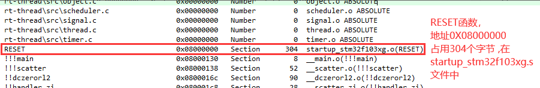

# stm32及C语言基础

## 封装寄存器

- stm32f103 总线结构

  

  - ICode: 指令的读取和执行
  - DCode:数据的读写
  - system:内核的系统总线到外设

- 存储结构

  - 存储器和IO外设采用统一编址

  - 空间分为8块，每块512MB，总计4GB

  - 其中Block2用于片上外设（0x4000 0000 ~0x5FFF FFFF）

    

    > stm32f429的内存映射做参考
    >
    > 

  - GPIOB挂在APB2下

    

- 操作寄存器

  - 直接地址访问

    
  
    > GPIOE_ODR = GPIOE_BASE+0x0C
    >
    > GPIOE_BASE = APB2PERIPH_BASE + 0x1800
    >
    > APB2PERIPH_BASE = PERIPH_BASE + 0x10000
    >
    > PERIPH_BASE = 0x40000000
    >
    > 所以：
    >
    > GPIOE_ODR = 0x4001180C（寄存器的起始地址）
  
    ```c
    *(unsigned int *)(0x4001180C)&= 0x00;   
    ```
  
  - 程序映射访问
  
    ```c
    //外设基地址PERIPH_BASE
    #define PERIPH_BASE           ((uint32_t)0x40000000)
    //总线基地址，在外设基地址上加上偏移
    #define APB1PERIPH_BASE       PERIPH_BASE
    #define APB2PERIPH_BASE       (PERIPH_BASE + 0x10000)
    #define AHBPERIPH_BASE        (PERIPH_BASE + 0x20000)
    //GPIO外设基地址，在APB2总线基地址上加上偏移
    #define GPIOA_BASE            (APB2PERIPH_BASE + 0x0800)
    #define GPIOB_BASE            (APB2PERIPH_BASE + 0x0C00)
    #define GPIOC_BASE            (APB2PERIPH_BASE + 0x1000)
    #define GPIOD_BASE            (APB2PERIPH_BASE + 0x1400)
    #define GPIOE_BASE            (APB2PERIPH_BASE + 0x1800)
    #define GPIOF_BASE            (APB2PERIPH_BASE + 0x1C00)
    #define GPIOG_BASE            (APB2PERIPH_BASE + 0x2000)
    //定义GPIO外设结构体(可以适用于所有GPIO)，因为结构体成员在内存中是连续的，这种形式与寄存器组非常类似，所以用结构体能够很好的管理寄存器
    typedef struct
    {
      __IO uint32_t CRL;
      __IO uint32_t CRH;
      __IO uint32_t IDR;
      __IO uint32_t ODR;
      __IO uint32_t BSRR;
      __IO uint32_t BRR;
      __IO uint32_t LCKR;
    } GPIO_TypeDef;
    
    //这个宏定义将结构体里的变量声明为寄存器变量，保证这些寄存器的值能够在程序运行中随时被读写
    #define     __IO    volatile 
    //定义GPIOA结构体指针，因为单单定义GPIO外设结构体，并不能确定其内存地址，因此用指针将其绑定到GPIOA外设基地址
    #define GPIOA               ((GPIO_TypeDef *) GPIOA_BASE)
    //映射访问
    GPIOE->ODR=0<<5;
    ```

## 函数指针

函数指针：指向函数的地址

```c
void (*p)(int a, int b)
```

函数加不加`&`都是函数地址

回调函数 就是 定义一个函数指针，然后可以往指针中传入符合函数指针类型的函数地址。

## 链表

内存：

- 优点：可以随机访问，存储读取速度快

- 缺点：需要足够连续的一块内存空间，空间大小固定，不能动态扩展插入，删除麻烦

链表

- 优点：内存利用率高，空间可调，扩展灵活，插入删除方便
- 缺点：不能随机查找读取存储或者删除数据需要遍历链表，比较慢

循环链表的插入和删除：

- 插入
  1. 插入结点的分别指向前后结点
  2. 前后结点分别指向插入结点
- 删除
  1. 后结点指向前结点
  2. 前结点指向后节点

定义结点和链表：

```c
typedef struct LIST_NODE{
    int data;
    struct LIST_NODE *pxNext;
    struct LIST_NODE *pxPrevious;
} ListNode   //结点
typedef struct LIST{
    unsigned int NumberOfNodes;
    ListNode RootNode;      //循环链表参考点
}List  //链表

```

## CPU与外设

- 访问单个设备

  

- 访问多个设备

  cpu只负责发送地址，内存管理器，根据地址通过片选引脚选中设备来选择外设。片上外设都属于同一个地址空间

  

- 单个设备自己的片选

## C语言的本质

程序的入口由硬件决定

> 硬件会让cpu从flash中读第一条指令来执行

程序的执行是我们控制的

`char c = "A" `转汇编   STRB 操作一字节

`int b =1`转汇编  STR 操作四字节

声明只是指导编译器工作，根据声明知道操作多少空间	

## 变量

Cpu flash ram（内存）

变量，可以变，可读可写，都存在内存中，指针（地址）在32位处理器中都是4字节

 ## 关键字

- const

  只读的常量放在flash中，加const放于ram中，节省内存

- sizeof（运算符）

  ```c
  Char *p;
  Int *p2;
  
  Sizeof(*p)  = sizeof(int)
  Sizeof(p) = 32
  ```

- Volatile 

  Volatile 防止编译器优化（只在cpu中改变），必须要把值写入内存中用于必须要读的寄存器

- Extern

  Extern 可以在文件中直接写，也可以在包含的头文件里面写

  不建议使用全局变量，要的话用static，可以做一个函数接口 get_x()让别人获得变量的值,Extern建议放在.h文件中声明

## 结构体

struct类型声明不占空间，声明变量占空间

Struct 里面定义的变量类型和非4的倍数，在内存中会优化到占4个字节

对齐保证效率高

写几个字节取决于什么类型

## 变量赋值：

p值获取地址，用*p赋值，可能会数据溢出

```c
Struct person {
	Char a;
	Char b
	Int c;
}

struct person wei = {“1”, ”2”, 1};
struct person *pt;
*pt = wei;  //把wei的值全部赋给*pt
//*pt 也是一个person结构体类型；(故并非传地址)
//pt是指针类型
```


结构体声明中，不可以放结构体，但可以放结构体指针，结构体用.取成员

指针用 ->取成员

 ## 函数指针

```c
void a(void){
    printf("a\n");
}
void (*p)(int);
p = a;
```

定义函数指针，function是变量，占4字节，function和&function都一样 。

- Typedef （类比 #define,define是宏定义，直接替换），typedef是类型定义 可以创建类型别名，可以让使用更方便(const)。

  ```c
  
  /********************/
  
  typedef char (*p)(int);   //定义一种p的类型
  p pfun;                   //定义p类型变量(函数指针)pfun
  char gfun(int x){ 
      printf("x\n");
      return;
  }
  
  int main()
  {
      pfun = gfun;
      (*pfun)(2);
      pfun(2)
  }
  ```
  
  ***其实，无论什么时候，只要为指针声明 typedef，那么就应该在最终的 typedef 名称中加一个 const，以使得该指针本身是常量。***

 

## 结构体指针：

结构体指针进行传递只需要 4字节，避免了传递结构体，省空间


## arm架构与汇编

```c
Int a =1;
Int b = 2
a = a+b;
```

汇编


有初始值的全局变量 直接复制到data段

无初始值的全局变量 集中拷贝到ZI段 然后一起置0

ZI段和data段一起叫做全局区

串口 TTL  RS232（3~12 -3~-12） RS485差分


# 内存管理

## 一、Flash 与 RAM

### Flash

> 属于非易失型存储器，FLASH又称为闪存，不仅具备电子可擦除可编程(EEPROM)的性能，还不会断电丢失数据同时可以快速读取数据，U盘和MP3里用的就是这种存储器。

NOR Flash：stm32 采用的存储的代码可以直接运行   

NAND Flash：，一次读512Byte，用户不能直接运行

***Flash 相对容量大，掉电数据不丢失，主要用来存储 代码，以及一些掉电不丢失的用户数据***

### RAM

> 属于易失型存储器，RAM随机存储器（Random Access Memory）表示既可以从中读取数据，也可以写入数据。当机器电源关闭时，存于其中的数据就会丢失。比如电脑的内存条

SRAM：静态RAM(Static RAM/SRAM)，SRAM速度非常快，是目前读写最快的存储设备了，但是它也非常昂贵，所以只在要求很苛刻的地方使用，譬如CPU的一级缓冲，二级缓冲。

DRAM：动态RAM(Dynamic RAM/DRAM)，DRAM保留数据的时间很短，速度也比SRAM慢，不过它还是比任何的ROM都要快，但从价格上来说DRAM相比SRAM要便宜很多，计算机内存就是DRAM的。


#### 为什么需要RAM

***因为相对FlASH而言，RAM的速度快很多，所有数据在FLASH里面读取太慢了，为了加快速度，就把一些需要和CPU交换的数据读到RAM里来执行***

***STM32单片机内部的 RAM 为 SRAM。
RAM相对容量小，速度快，掉电数据丢失，其作用是用来存取各种动态的输入输出数据、中间计算结果以及与外部存储器交换的数据和暂存数据。***


## 二、STM32 内存架构

### ARM Cotrex-M3存储器映射分析


###  STM32 的存储器映射分析

STM32F103xCDE数据手册中的存储器映射表


stm32内存管理主要为0X0800 0000开始的 Flash 部分 和 0x2000 0000 开始的SRAM部分

#### STM32的Flash组织

stm32中文参考手册


**主存储器**，该部分用来存放代码和数据常数（如加const类型的数据）。对于大容量产品，其被划分为256页，每页2K，小容量和中容量产品则每页只有1K字节。主存储起的起始地址为0X08000000，B0、B1都接GND的时候，就从0X08000000开始运行代码。

**信息块**，该部分分为2个部分，其中启动程序代码，是用来存储ST自带的启动程序，用于下载，当B0接3.3V，B1接GND时，运行的就这部分代码，用户选择字节，则一般用于配置保护等功能。

**闪存储器块**，该部分用于控制闪存储器读取等，是整个闪存储器的控制机构。

对于主存储器和信息块的写入有内嵌的闪存编程管理；编程与擦除的高压由内部产生。

在执行闪存写操作时，任何对闪存的读操作都会锁定总线，在写完成后才能正确进行，在进行读取或擦除操作时，不能进行代码或者数据的读取操作。

## STM32内存管理

> 即对0X0800 0000 开始的 Flash 部分 和 0x2000 0000 开始的 SRAM 部分 的使用管理

### 三种存储属性区

> (加载域)ARM映像文件(image文件)的组成：包含了RO和RW-data。不包含ZI-data只要程序运行之前将ZI-data所在的区域一律清零即可
>
> (运行域)ARM程序的组成：***一个ARM程序包含3部分：RO，RW和ZI***。此处所说的"ARM程序"是指在ARM系统中正在执行的程序，而非保存在ROM中的bin映像（image）文件，这一点清注意区别。 
>
> ARM程序执行过程(加载域到运行域)：ROM中的指令至少应该有这样的功能
>
> 1.  将RW从ROM中搬到RAM中，因为RW是变量，变量不能存在ROM中。
>
> 2. 将ZI所在的RAM区域全部清零，因为ZI区域并不在Image中，所以需要程序根据编译器给出的ZI地址及大小来将相应得RAM区域清零。ZI中也是变量，同理：变量不能存在ROM中。在程序运行的最初阶段，RO中的指令完成了这两项工作后C程序才能正常访问变量。否则只能运行不含变量的代码。


**RO**：

只读区域，包括RO_data和code。

- **Code：**
  程序代码部分。
  .text 段
  放在Flash(ROM)里面，需要占用flash空间

- **RO-data**
  (Read Only)只读数据
  程序定义的常量,只读数据，字符串常量（const修饰的）
  .constdata 段
  放在flash(ROM)里面，需要占用flash空间

**RW-data**
(Read Write)可读可写数据
已经初始化的全局变量和静态变量（就是static修饰的变量）；
.data 段
保存在 Flash里面，程序运行后复制到 RAM里面运行，需要占用Flash空间

**ZI-data**
(Zero Initialize)未初始化的全局变量和静态变量，以及初始化为0的变量；
.BSS段
ZI的数据全部是0，没必要开始就包含，只要程序运行之前将ZI数据所在的区域（RAM里面）一律清 0，不占用Flash，运行时候占用RAM.

heap 和 stack 其实也属于 ZI，只不过他不是程序编译就能确定大小的，必须在运行中才会有大小，而是是变化的


因为RAM掉电丢失，所以 RW-data 数据也得下载到ROM（flash） 中，在运行的时候复制到 RAM中运行，如下图所示（**图中的地址也是错的，应该是从0x0800 0000 开始**）：


### 6个储存数据段


**stack（栈）**

栈又称堆栈，是用户存放程序运行过程中临时创建的局部变量、函数的参数和返回值(但不包括static声明的变量，static意味着 放在 data 数据段中)，由系统自动分配和释放。
除此以外，在函数被调用时，其参数也会被压入发起调用的进程栈中，并且待到调用结束后，函数的返回值也会被存放回栈中。
Cortex-M3/M4的堆栈是向下生长，符合LIFO(后进先出)，的特点所以栈特别方便用来保存/恢复调用现场。
从这个意义上讲，我们可以把堆栈看成一个寄存、交换临时数据的内存区。
放在RAM里，其大小定义在启动文件startup_stm32fxx.s中。

**heap（堆）**

堆是用于存放进程运行中被动态分配的内存段。他的大小并不固定，可动态扩张或者缩减，由程序员使用malloc()和free()函数进行分配和释放。当调用malloc等函数分配内存时，新分配的内存就被动态添加到堆上（堆被扩张）；当利用free等函数释放内存时，被释放的内存从堆中被剔除（堆被缩减）。
放在RAM里
其可用大小定义在启动文件startup_stm32fxx.s中。

> 堆栈的大小是在startup_stm32fxxx.s中设置的
>
> 
>
> startup_stm32fxxx.s主要完成三个工作：**栈和堆的初始化、定位中断向量表、调用Reset Handler**。

**.bss**

Block Started by Symbol。储存未初始化的，或初始化为0的全局变量和静态变量。
BSS段属于静态内存分配，所以放在RAM里。

**.data**

数据段，储存已初始化且不为0的全局变量和静态变量（全局静态变量和局部静态变量）。
static声明的变量放在data段。
数据段属于静态内存分配，所以放在RAM里，准确来说，是在程序运行的时候需要在RAM中运行。

**.constdata**

储存只读常量。const修饰的常量，不管是在局部还是全局
放在Flash 里。
所以为了节省 RAM，把常量的字符串，数据等 用const声明

**.text（CodeSegment/Text Segment）**

代码段，储存程序代码。也就是存放CPU执行的机器指令(machineinstructions)。这部分区域的大小在程序运行前就已经确定，并且内存区域通常属于只读(某些架构也允许代码段为可写，即允许修改程序)。
在代码段中，也有可能包含一些只读的常数变量，例如字符串常量等放在Flash里。

> 全局静态区，文字常量区，程序代码区是从内存地址分配的角度来描述的。
>
> **全局区（静态区）（static）**—，全局变量和静态变量的存储是放在一块的，初始化的全局变量和静态变量在一块区域， 未初始化的全局变量和未初始化的静态变量在相邻的另一块区域。
>
> **文字常量区**—常量字符串就是放在这里的。
> **程序代码区**—存放函数体的二进制代码。

***一般情况，一个程序本质上都是由 bss段、data段、text段三个段组成——这是计算机程序设计中重要的基本概念。而且在嵌入式系统的设计中也非常重要，牵涉到嵌入式系统运行时的内存大小分配，存储单元占用空间大小的问题。***

> [从内存的角度观察 堆、栈、全局区（静态区）（static）、文字常量区、程序代码区 - huhuuu - 博客园 (cnblogs.com)](https://www.cnblogs.com/huhuuu/p/3440187.html)


## 四、.map文件简析 


### Section Cross References

不同文件中函数的调用关系


查看clock.c 文件下的 `rt_tick_increase`函数


### Removing Unused input sections from the image

被删除的冗余函数


> 删除函数功能在MDK的配置中可以设置，勾选以后删除得多，不勾选删除得少，如下图：
>
> 

### Image Symbol Table

#### Local Symbols(局部标号)
用Static声明的全局变量地址和大小，
C文件中函数的地址和用static声明的函数代码大小，
汇编文件中的标号地址（作用域限本文件）：




我们在 startup_stm32f103xg.s ，可以看到RESET函数：


上图中的 i.RCC_Delay 下面跟了一个 RCC_Delay，说明这个函数是用static修饰的，我们找到 stm32f1xx_hal_rcc.c下的`RCC_Delay` 如图：


SRAM:


我们继续看到后面的.bss段，包括了 HEAP 和 STACK区域：


通过上图中我们可以看到 HEAP 的起始地址为 0x20002338，
ram从 0x2000 0000开始存放的依次为 .data、.bss、HEAP、STACK。
HEAP在 startup_stm32fxxx.s 中定义过大小为 0x200，
所以结束地址为0x20002538， HEAP 是和 STACK连接在一起的，所以STACK的起始地址为 0x20002538，大小 0X400，结束地址为 0x20002938。
最后我们可以看到 __initial_sp 指向的是 0x20002938，入栈从高地址开始入栈，地址越来越小。

#### Global Symbols全局标号

全局变量的地址和大小，
C文件中函数的地址及其代码大小，
汇编文件中的标号地址（作用域全工程）：


在 startup_stm32fxxx.s 能看到对应的部分：


看到最后的 RAM区，注意下图中标出的两行的功能：


#### Memory Map of the image

映像文件可以分为加载域（Load Region）和运行域（Execution Region）：加载域反映了ARM可执行映像文件各个段存放在存储器中时的位置关系。


其中还能看出来 Flash中存放的都是 code，和 RO_Data:

我们看看SRAM部分：


我们看看SRAM部分:
需要注意一下，我们前面代码he 数据部分都是4字节对齐，PAD一般都是补充2个字节，到了栈部分，需要8字节对齐:


#### Image component sizes

存储组成大小
这部分的内容就比较直观

最后就是我们熟悉的部分：


## STM32启动

### 启动方式

选择BOOT0/1


在离开复位状态后， CM3 做的第一件事就是读取下列两个 32 位整数的值：

-  从地址 0x0000,0000 处取出 MSP 的初始值。
-  从地址 0x0000,0004 处取出 PC 的初始值——这个值是复位向量， LSB 必须是 1。然后从这个值所对应的地址处取指。这个数值取决于BOOT0和BOOT1的选择


### STM32启动地址和Bootloader

需要添加Bootloader时，才需要改程序启动地址，官方在0x1FFF F000处写入了一段Bootloader供使用，我们也可以自己写一段 BootLoader 程序方便自己使用，因为是自己写的，他还是用户程序，只是我们自己把程序分成了 BootLoader部分和 应用程序部分，大概的意思如下图所示：


> 为什么需要BootLoader？
>
> 项目中，可能经常需要换程序，每次都烧录很麻烦，自己写Bootloader可以使程序通过别的方式升级