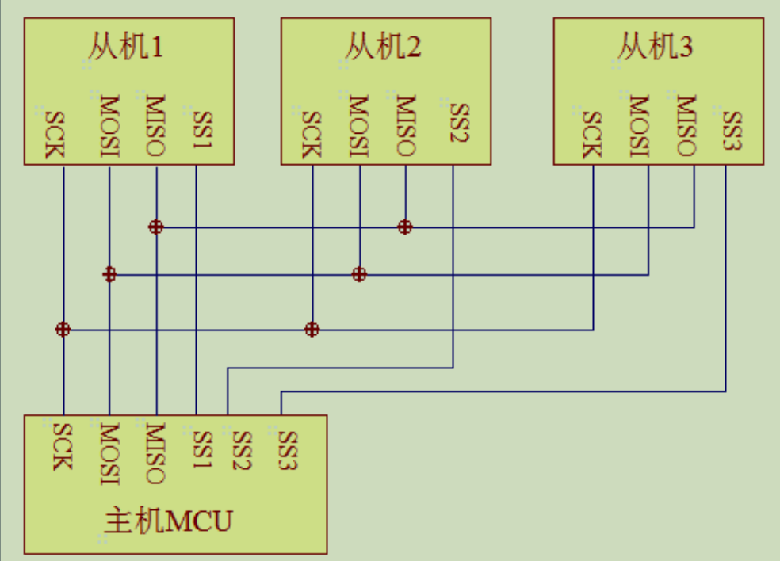

# 嵌入式总结：

## 接口协议：

1. GPIO：

   - 通用的输入输出接口 ，stm32能够直接控制的接口，输出：高低电平 ..     输入：检测电平高低..  

   - 复用功能输出：stm32的其他片上外设对GPIO进行控制，此时GPIO引脚用作片上外设的一部分，算是第二功能

2.  串口通讯：设备间常见的串行通讯方式，简单便捷，大部分电子设备都支持，调试

   - 物理层：9条线（主要3条：**TXD、RXD、GND**）

     ​    

     - RS232：**抗干扰能力强** 逻辑1:-15v~-3v ；逻辑0：+3v~+15v 
     - TTL电平：5v TTL 逻辑1：2.4v-5v； 逻辑0: 0-0.5v
     - RS485

   - 协议层

     

     - 有效位数 5-8；起始1个逻辑0数据位；结束0.5、1、1.5、2个逻辑1数据位；校验 奇、偶、0、1、无； 

3. I2C

   > 引脚少、硬件实现简单、可扩展性强、无需外部收发设备，常用于系统内多个集成电路间的通讯

   - 物理层

     

     - 是支持设备的总线，一个I2C通讯总线中支持多个从机和主机

     - ***一个I2C总线使用两条数据线：一个双向串行数据线SDA，一个串行时钟线SCL***
     - **每个接到总线的设备有独立的地址**
     - 总线通过上拉电阻到电源
     - 多个主机同时使用总线时，会利用仲裁方式决定哪个设备占用
     - 三传输模式：普、快、高
     - 接到相同总线的ic数量受总线最大电容400pF限制

   - 协议层

     > 主写从、主读从、通讯复合格式

     

     

     - 起始：SCL高电平时，SDA从高向低电平切换；停止：SCL高电平时，SDA从低向高电平切换。

     - 数据有效性：SDA数据线在每个SCL时钟周期传输一位数据，SCL高电平保持时，SDA数据有效；SCL低电平时,SDA数据无效

        

4. SPI

   > 串行外围设备接口，高速全双工的通信总线，广泛用于ADC\LCD和MUC之间、要求通信速率较高场合、flash、eeprom

   - 物理层

     

     三条总线及一条片选线,所有设备并联三条总线，一个从机设备对应一条片选线、只有一个主机

     - CS

       起始信号：主机选择从设备时，设置从设备的片选线为低电平，停止信号：置高从设备片选线。

     - SCK

       由通讯主机产生的时钟线、不同设备支持不同速率

     - MOSI

       主输从入

     - MISO、

       主入从输

   - 协议层

     

     - MOSI 、NSS、SCK都由主机产生，MISO从机产生。
     - NSS低电平时，数据有效，在SCK每个时钟周期MOSI和MISO传输一位数据，输入输出同时进行，数据位在SCK上升沿期间变化输出、下降沿期间被采样 ，高电平数据1，反亦

5. modbus

   - 物理层

     半双工通信、可远距离传输

      RS485信号采样差模传输, 逻辑1：Uab>=200mv，逻辑0：Uab<= -200mv

     > 

   - 协议层