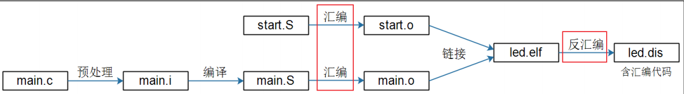
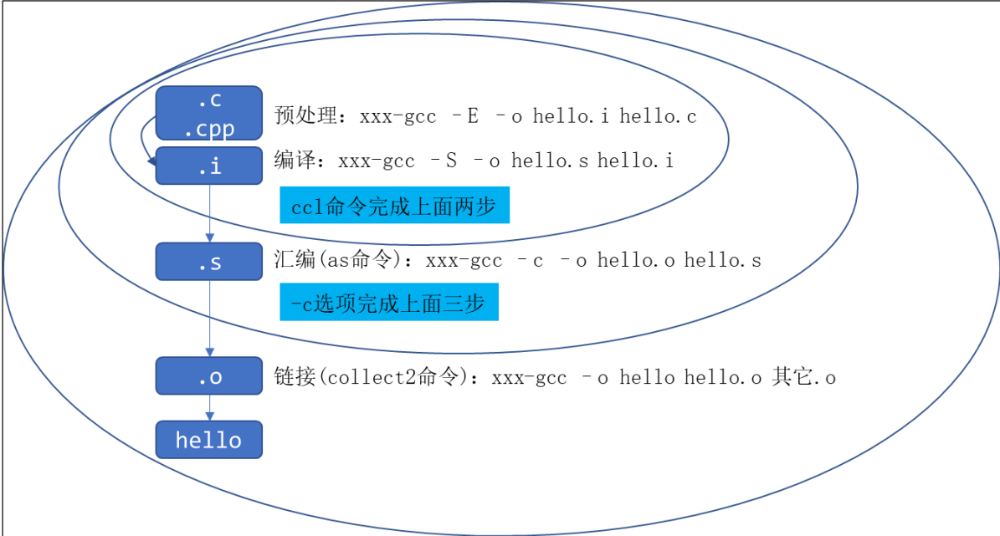
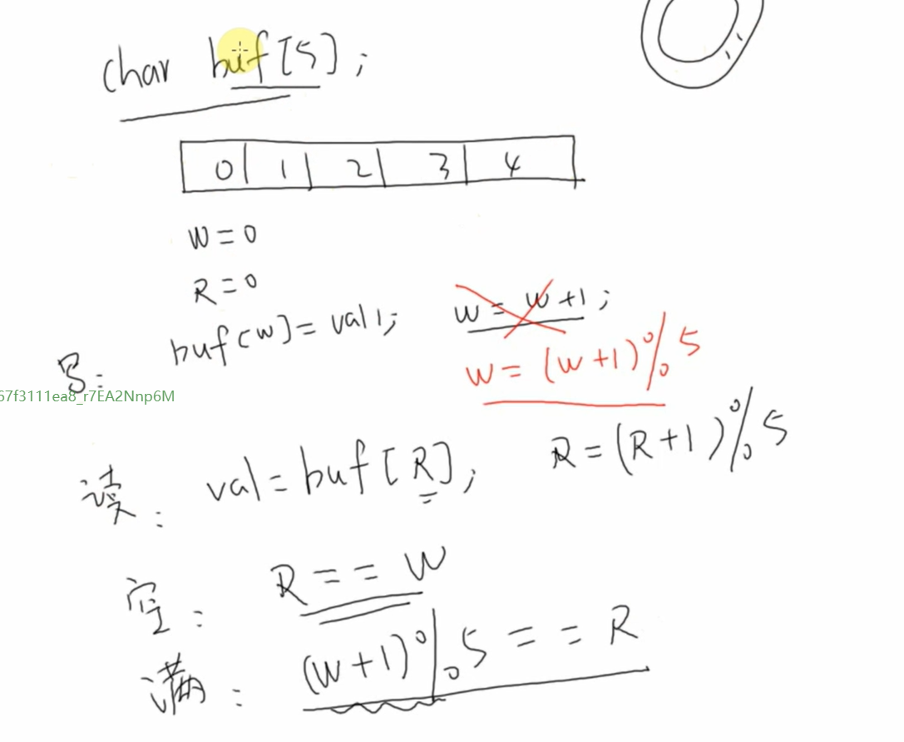

# 应用开发


## GCC编译器

- 编译过程

  

- GCC选项过程说明

  

## 输入系统

### 框架

- 驱动层从硬件获取数据
- 核心层将数据抽象成结构体，上传给事件层
- 事件层有多种处理方式，将数据分发给APP event_handler 常用

### 流程

1. APP读取数据，若无数据则休眠
2. 用户操作设置，硬件产生中断
3. 输入系统对应驱动程序处理中断
4. 核心
5. app处理数据

### 表示一个输入设备

- type 哪些类型事件：屏幕有按键 相对位移

- code 该类事件下的哪个事件 ：键盘的不同按键

- value 值 坐标，压力值等

- 事件界限 ：同步事件，例如12字节0


> 通过hexdump 分析设备数据信息

### 获取设备信息

```c
int ioctl(int fd, unsigned long request, ...);
```

通过指定的命令来实现对应的操作

- 查询方式：调用open时 ，传入O_NONBLOCK表示非阻塞；app调用read函数读取数据时，如果驱动程序中有值立刻返回，无值就返回错误。

- 休眠—唤醒方式：调用open时，(不传入O_NONBLOCK）默认阻塞的情况下，调用read,有值时函数会立刻返回数据；否则app会在内核态休眠，当有数据时，驱动设备会把app唤醒，read函数恢复执行，并返回值给app

- poll方式：

  ```c
  int poll(struct pollfd fd[], nfds_t nfds, int timeout);
  struct pollfd{
  　　int fd;          //文件描述符
  　　short events;    //请求的事件
  　　short revents;   //返回的事件
  　　};
  ```

  机制类似闹钟，fd 传入一个结构数组，设置值来控制(fd)文件描述符，等待的事件及返回的事件，第二参数传入监测的文件数，第三参传入超时时间，在超时时间结束时还无数据则返回错误

- 异步通知方式

  > 同步就是等你一起，异步就是app先做自己的工作，如果驱动程序用数据时给app发送数据，app就执行信号处理函数。

  **驱动程序**发**信号**：**SIGIO**给APP(APP先把自己告诉驱动)，收到后APP执行信号处理函数（APP通过注册信号处理函数将信号与信号处理函数挂钩）

  应用编程：

  1. 编程信号处理函数

     ```c
     static void func(int sig)
     ```

  2. 注册信号处理函数

     ```c
     signal(SIGIO,func)
     ```

  3. 打开驱动

     ```c
     fd = open(argv[1], O_RDWR);
     ```

     **fd = open(argv[1], O_RDWR);**

  4. 把进程id告诉驱动

     ```c
     fcntl(fd, F_SETOWN, getpid());
     ```

  5. 使能驱动的FASYNC功能

     ```c
     flags = fcntl(fd, F_GETFL);
     fcntl(fd, F_SETFL, flags | FASYNC);
     ```

## 网络通信

数据传输三要素：源、目的、长度

服务器:被动的响应；客户端：主动地发起请求

传输类别： tcp 可靠、重传、有连接；UDP：不可靠、无连接

用端口和ip来表示源和目的


服务器（TCP）：

```c
fd = socket();
bind(自己的ip，端口);
listen();//开始监测数据
accept();   //建立一条连接
/****/ send(); recv();
```

客户端

```c
fd = socket();
connect(目的); //建立连接
/****/recv();send()
```

UDP

```c
/*server*/
fd = Socket();
bind(自己IP，端口)；
/***/ send recv
/**client**/
fd = socket();
connet(目的);
or
sendto() //可以放目的地址

```


## 多线程编程

多线程比多进程更快，效率高

调度是以线程为单位

资源的分配是以进程为单位的

线程间通信：互斥量（在调用临界资源的前后上锁）、信号量、同步操作

```c
//创建线程
#include <pthread.h>
int pthread_create(pthread_t *thread, const pthread_attr_t *attr,void *(*start_routi
ne) (void *), void *arg);
```

## 串口通信

