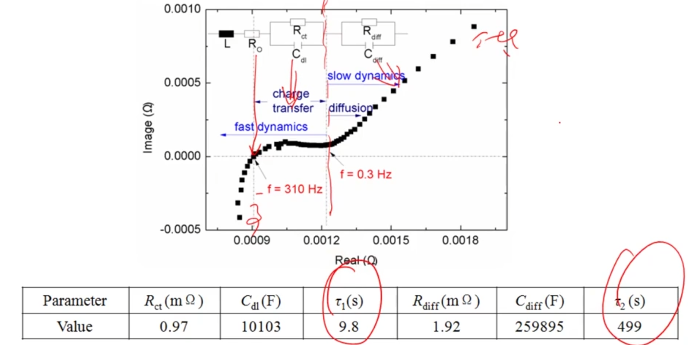
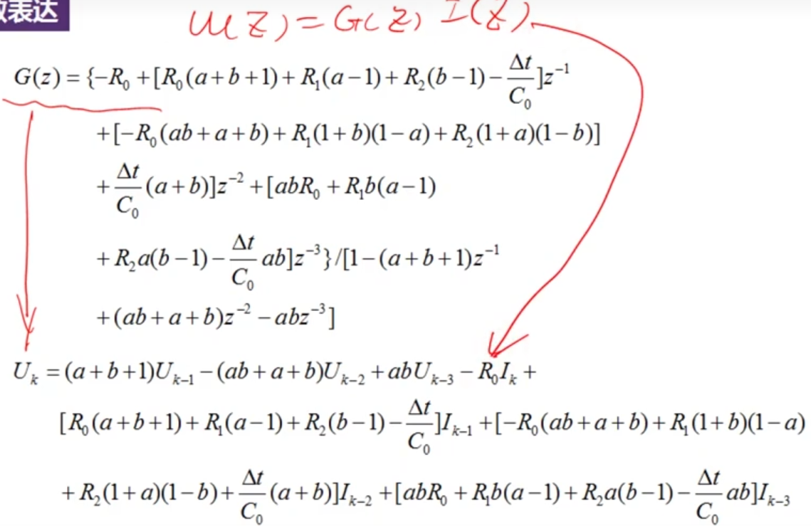
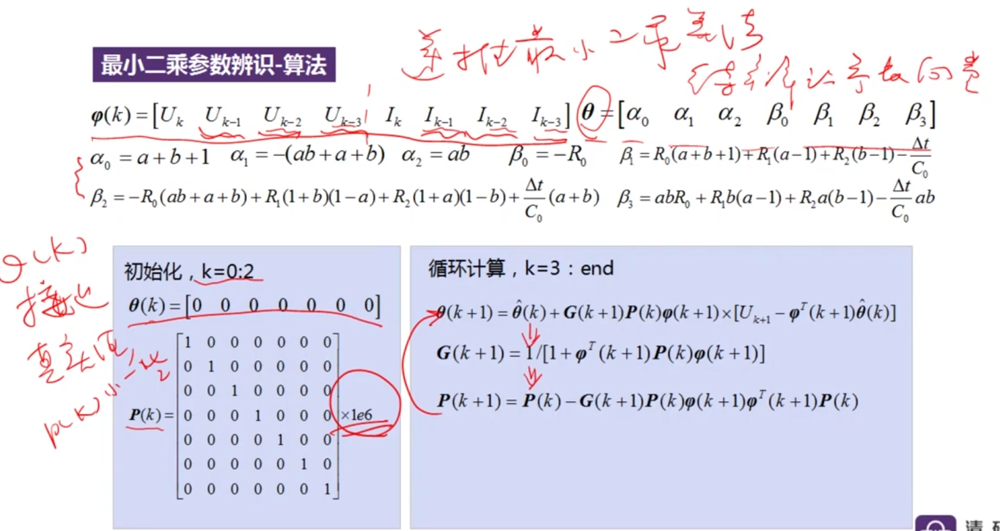

# 电池建模及SOC估计

可测量的外部状态（一次量）—>不可测量的内部状态（二次量）

## 电池建模及状态估计意义

根据实际电池的特性，建立电池模型，对比实际电池的输出和电池模型的输出得出误差，根据误差修正模型。

# 电池模型 

电池模型的分类

## 电特性模型

- 机理模型（电化学模型）

- 经验模型（电池等效模型ECM）

  优点： 从外部特性角度描述V-I特性；在某些工况及环境下，具有可以接收的精度；可以描述内部状态及参数的变化；模型运算量下，适用于在线应用。

  缺点：物理意义不清晰 ，对内部过程的对应关系很简化；在低温、大电流及老化等因素影响下，模型精度会有较大影响

  ocv（soc）：滞回特性，加上磷酸铁锂的电池ocv和soc曲线比较平缓，不好对应 

  阻抗特性模型：极化效应，需要加RC并联电路

  

关键点：多尺度效应、时变 效应

## 热特性模型

## 老化特性模模型

# 电池参数辨识

## 离线辨识

### 离线辨识(时域)

模型参数：

- 开路电压OCV(SOC)：通过实验得到SOC和OCV的关系

- 欧姆内阻，极化电阻和极化电容(需要在线辨识的主要参数)

模型输入工作电流I(t)，模型输出是端电压U(t)

> 实际输出为 U(t) - OCV = I(t)*Rz   辨识阻抗参数Rz

通过电流脉冲工况进行参数辨识，  

实验前置条件：通过充放电让电池调整到SOC点，放置在某一温度下，静置待电池达到某一平衡之后，

再进行充电或放电电流，产生端电压响应。

- U~R~ ：欧姆阻抗U~R~ = i*R~0~

- U~p~ ：零状态响应：┏ = R*C

  

- U~R~^1^：

- U~p~^1^：零输入响应：

  

### 离线辨识(频域)

近似认为电池是线性系统，给电池加入小的交流激励，电池会输出同频率的交流响应，幅值和相角会发生变化，利用输入输出的相角及相角关系可以得到交流阻抗，用奈奎斯特图表示交流阻抗可以得知电池的等效电路模型有什么组成

> 软件Zsimp Win进行电池参数辨识
>
> 

### 离线辨识 (时、频域结合)

针对电池动态特性的多时间尺度问题，在时域和频域取不同时间尺度

在频域确定小尺度(τ小)，在时域确定大尺度(τ大)

#### 小时间尺度：通过阻抗谱的特征频率确定

#### 大时间尺度

大时间尺度的时域确定方法:直流脉冲测试+频域中的小时间尺度参数:最小二乘拟合

> 代入小时间尺度辨识的参数

### 典型结果

1. 特性1：多时间尺度

   > 对在线辨识，离线辨识都有影响

   

2. 特性2：时间常数随温度及SOC变化规律 

   温度增加，时间常数越小。(内部化学反应变快)

   

   小时间尺度：SOC低和高的时候，时间常数较小。(电池某一极的离子浓度高，化学反应快)

   大时间尺度：和离子的嵌入和脱嵌有关(SOC两端，固相离子浓度高，离子嵌入就会受到影响 )

## 在线辨识

> 电池在不同温度、老化条件下，电池模型参数不一样
>
> 希望模型精度高的话，希望模型的参数会自适应调整
>
> 简单办法把多种工况下的模型参数列成表格，应用时通过查表更新模型，工作量太大
>
> 在线辨识

BMS利用当前电流电压数据及历史工况，通过一定算法吧模型参数在线辨识出来。

将真实电池系统的输出和模型的输出之间的误差输入算法，优化模型

模型误差：模型结构本身(假定正确)、模型参数

### 最小二乘参数辨识-模型的离散表达

化简：

化简得最终算法

在线辨识用递归最小二乘算法，输入电压电流，输出θ(α和β)等数值，后求出a、b，进而求出R、C

初始值φ(k)准的话，P(k)可以小一些，(此处不准，需要大)，使用当前时刻的电流电压关系，结合前三个时刻的电流电压关系，不停的迭代出目标值θ，进而得到待辨识参数

结果

因为初始值不太准，故开始时波动比较厉害

> 某些情况下，RC环节参数无法准确辨识甚至无法收敛

问题：

- 激励要求

  

- 数值计算

  

- 模型特性的多时间尺度问题

  

- 

改进：

- 多时间尺度辨识 

  - 基本思想

    对不同时间常数的环境在不同时间尺度上进行辨识

    

  - 具体实现

    

    慢速变化环境的参数辨识，根据SOC的变化来判断要不要做参数辨识，这样能自适应工况 ，SOC变化量用安时积分计算

    快速变化环节的参数辨识，保持慢速环节的参数不变的，慢速变化环节也一样，保持快速环节的参数不变

    结果对比

  - 多时间尺度辨识结果

    - 参数辨识结果

      - 

      收敛时间：小时间尺度辨识比较快，大时间尺度辨识的比较慢(辨识时间不确定，故横坐标用步数)

    - 脉冲测试(时域)情况下：

      

      选择144s，脉冲时间长才能显示出大时间尺度部分的效果，但是不希望太长，因为脉冲时间太长，SOC会变化比较大，因为参数是和SOC有关系的，SOC变化大，参数就无意义了

      多时间尺度自适应辨识方法，相对于普通最小二乘法辨识，辨识的参数代入到模型中更符合真实电压

    - 工况测试

      

      在参数稳定后，自适应辨识方法的数据更接近

    - 参数一致性分析

      

      希望在一样的激励下，模型输出的端电压和实车保持一致，对于参数的调整无约束条件，有多种组合可以保证模型端电压和实车一致，故不同工况下，辨识出的参数可能不一致 

      传统辨识方法在不同工况下，辨识的参数有较大差异，对SOH等参数估计有较大影响

      多时间尺度辨识的一致性较好

    - 模型结构导致的误差会体现到参数误差中
      经验集总参数等效电路模型，在无约束条件下，辦识得到的参数的物理意义其实并不明确，一个最常见的表现是不同工况辨识得到参数值不同。这本质上是模型
      结构的问题
      可以通过算法，人为添加约束（如之前的多时间尺度设计）缓解上述问题的影响

    

# SOC估计

- 常见方法

  开路电压法，安时积分法、基于模型的方法、

## SOC的定义

> 有多种SOC定义，

SOC=1 -（Q放电电量/Q老化电池额定容量）

- 符合实际情况
- 对温度有较好适应性
- 对电池单体不一致问题有较好适应性
- 便于后期老化电池容量的在线估计

## SOC估算的问题

- ocv-soc曲线

  > LFP 磷酸铁锂电池斜率明显，可以一定程度反映关系(标称电压3.2V ,循环次数高，耐高温。材料便宜)
  >
  > NCM 三元锂电池30%-80%区间较为平坦，难以反映变换(正极材料是镍钴锰，标称电压3.7V，循环性一般，放点倍率高)

- 电池温度敏感特性一定程度影响SOC
- 电池系统成组后，单体间不一致性影响
- 采集精度
- 电池寿命影响

## 方法

### 常规方法

- 安时积分法

  

  

  缺点：电流采样器误差，初始值的误差，电池额定容量

- 开路电压法

  

  通过对照SOC-OCV曲线来得到SOC值，尤其在两端效果较好

  缺点：需要静止足够长时间才能得到稳定的电压(锂电池通常为几h)

- 阻抗法

  

  实验得到交流阻抗谱，通过查表得到对应的SOC值

  缺点：设备贵，通常在实验室进行测量；通常针对单个电池

- 智能估计算法

  神经网络的方法，适用于各种电池，只要数据够，方法得当，估计误差较好

  缺点：需要大量数据；受训练方法的影响

- 状态观测器

  卡尔曼滤波

  把电池看作动态系统，建立系统状态空间方程，soc作为内部状态量，输入为电流和温度，输出为电池工作电压， 通过卡尔曼滤波在线估计出SOC

### 开路电压和电流积分法

 缺点：

- 电流测量误差的影响
- 初始化误差的影响无法校正
- 电池可用容量受温度和老化影响，温度影响可查表，老化影响难解决
- 总结：开环估计，无闭环校正

充电末期及放电末期修正：

利用SOC两端时，SOC-OCV曲线的对应效果比较好，进行校正

### 卡尔曼滤波

#### 卡尔曼滤波原理

>  做状态估计时，将状态作为信号去处理，利用一定的统计特性，保留估计结果中有用成分，同时把噪声去除掉。

状态方程和输出观测方程、ω~k~是模型不精确或者一写未知输入导致的噪声、ν~k~是传感器引起的观测噪声，同时假定两个噪声是互不关联的高斯白噪声

χ~k~^-^是预测值，χ~k~^+^是校正之后的值，循环计算的式2是预测的不确定度，循环计算的式5是状态向量误差的方差阵 (值越大表明不确定性越低)， L~k~是卡尔曼增益(类似信噪比，信噪比高，数据可靠，增益就大)

先有预测值，再结合采集到的值y，对预测值进行校正

#### 扩展卡尔曼滤波EKF原理

> 电池系统中存在非线性系统，应用时多用EKF，应对非线性系统

f()和g()都是非线性传递函数

f()和g()在当前可微，将两函数做一阶线性展开，展开后重新定义A、C矩阵，得到新的状态空间方程

卡尔曼滤波和EKF差别主要在状态矩阵和输出矩阵的差异上

#### 应用

等效电路模型的状态空间描述

soc值的方程、零状态响应方程、零输入响应方程输出观测方程，x为状态向量(包括SOC,和两电容上的电压)，推出f()和g()函数

非线性主要在g()中的OCV部分

 

C~k~的值需要求导获得

#### 算法的稳定性及意义

数学证明可用

物理意义  

OCV的限制作用，保证估计得到的SOC不会偏离真实值太远

#### 结果示例

收敛性：多电流工况组成，电压的突变由R0导致，电压的缓变由RC导致，整体电压走势由OCV导致

变工况及温度验证：温度升高，内阻变小，电压变化幅值变小，

模型影响的验证：

模型结果影响较大

### 问题讨论

>  模型参数的时变性
>
> 非线性
>
> 噪声：对噪声有假设条件，实际噪声不满足会有影响。
>
> 电池之间会有差异

1.  噪声方差阵的设定问题

   

   实际应用中，通过调试得到系统噪声和量测噪声的值

1. 1 
2. 1