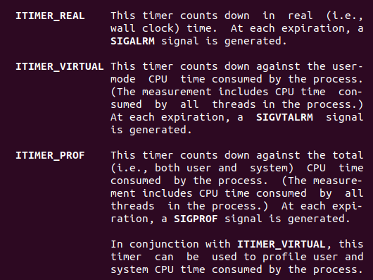

# 并发

> 同步：会发生的事情都知道，同时做不同的事情（俄罗斯方块下落时响应键盘的操作   
>
> 异步：会发生什么事情不知道。发生时间和发生结果未知 
>
> 异步时间处理方法：查询法（发生频繁）、通知法（发生稀疏）、
>
> 信号为初步异步，线程为更深入的异步（不同时使用）

## 信号

1. 信号的概念
   信号是软件中断   
   信号的响应依赖于中断
   core文件是信号发生的现场（需要设置允许的core文件大小）

2. signal() 设置信号会触发什么行为，信号会打断阻塞行为。(最简单的信号函数)
   - 可重入的风险，用于多个信号触发同一个处理函数（嵌套调用）的话可能被重复调用，需要sigsetmask其他信号，比较麻烦，可以用sigaction
   - 不区分信号的来源，直接执行 

3. 信号的不可靠
   重复出现的第二次相同信号，第二次的执行现场会冲掉第一次信号的现场

4. 可重入函数：
   所有的系统调用都是可重入的，一部分库函数也是可重入的，如：memcpy
   只要函数有-r版本要防止用于信号处理函数中，要避免在信号处理函数中用可重入函数，

5. 信号的响应过程：
   内核在为每个进程维护的一组位图（32bit）：包括pending和mask等

   pending用来表示当前进程收到哪些信号，mask表示当前进程的状态

   信号从收到到响应有不可避免的延时。
   收到信号（位图改变），被中断后，在kernel那排队，轮到任务，从kernel态回到user态的时候，按位与mask&pending ，发现信号，然后置零去执行对应信号处理函数（一次只置一个，多个信号也一样，依次响应，处理信号对应函数后清对应pending位。）
   思考：如何忽略掉一个信号的
     标准信号为什么要丢失。
   标准信号的响应没有严格的顺序。
   不能从信号处理函数中随意往后跳。（setjump；longjump）可以保存掩码集

   信号处理函数中，只有系统调用可以放心用，要尽量小。

   ```c
   //信号处理函数中不能随意往后跳 可能会导致接下来无法看到对应信号
   int sigsetjmp(sigjmp_buf env,int savesigs);   //能保存掩码集，siglongjmp回跳时可以恢复
   void siglongjmp(sigjmp_buf env, int val);
   ```

   常用函数：

   1. int kill(pid_t pid,int sig); //给指定进程发送信号

   2. int raise(int sig);  // 给当前进程发送信号  

   3. unsigned int alarm(unsigned int seconds) //以秒为单位计时     

   4. int pause(void); //执行后进程进入无休止的暂停，直到遇到信号

      > 一般与pause配合使用 少用sleep，可能是alarm+pause组合而成，移植时有风险

   5. ```c
      setitimer(int which, const struct itimerval *new_value,struct itimerval *old_value) //先对it_value倒计时，当值为0时，触发信号，重置为it_interval,继续倒计时，一直循环
      ```

      > which 三种模式



​		两个结构体

```c 	
void abort(void);             //给当前进程发送SIGABRT信号，杀死当前进程，并返回一个出错现场
```

```c
int system(const char *command); //调用shell命令 相当于f e w封装 ，要注意阻塞（blocked） SIGCHLD ，忽略（ignored） SIGINT和SIGQUIT
```

***例题 使用单一计时器，利用alarm 或 setitimer 构造一组函数，实现任意数量的计时器

`int sleep(int seconds);` 替换

`int nanosleep()`

`int usleep(useconds_t usec)` `select()`

7. 信号集

信号集类型`sigset_t`

`sigemptyset();` 初始化

`sigfillset();` 

`sigaddset();`   添加信号

`sigdelset();`    删除信号

`sigismember(); `   

8. 信号屏蔽值

sigprocmask(int how, const sigset_t *set, sigset_t *oldset)

决定信号什么时候被响应

how的操作 针对set里的信号，oldset保存操作前信号集的状态

`int sigpending(sigset_t *set)`(实际应用偏少处)

9. 扩展

   - int sigsuspending(const sigset_t *mask)  可作为信号驱动程序，解除了某个信号集的阻塞（将信号屏蔽字恢复为mask）之后，马上进入等待信号（休眠）阶段（原子操作 ），如果捕捉到一个信号，且从信号处理函数返回，则suspending返回，且将进程的信号屏蔽字恢复为调用之前的值。 

     

   - ```c
     int sigaction(int signum, const struct sigaction *act, struct sigaction *oldact);
      //signum参数指出要捕获的信号类型，act参数指定新的信号处理方式，oldact参数输出先前信号的处理方式（如果不为NULL的话）。
     ```

     取代signal()函数,捕捉到对应信号进行信号处理的时候，屏蔽指定的信号，避免信号处理函数被嵌套调用

## 线程

1. 线程的概念

   一个正在运行的函数

   posix线程是一套标准，非实现

   线程标识：pthread_t

   ```c
   int pthread_equal(pthread_t t1, pthread_t t2);  //检测是否为一个线程
   pthread_t pthread_self(void);// 获取当前线程标识
   ```

2. 线程的创建

   ```c
   int pthread_create(pthread_t *thread, const pthread_attr_t *attr, void*(*start_routine) (void *),void *arg); /*
   start_routine兄弟线程就是这个函数，通过arg传参 ，多变量可以通过传结构体完成             */
   线程的调度取决与调度器策略
   ```

   线程的终止

   1. 线程从启动例程返回，返回值就是线程的退出码 

   2. 线程可以被同一进程中的其他线程取消

   3. 线程调用pthread_exit()函数、

      `pthread_join()`; 类似wait，但可以指定线程 

   栈的清理

   `void pthread_cleanup_push(void (*routine)(void *),void *arg)`类似钩子函数，逆序触发

   `void pthread_cleanup_pop(int execute)` 内部实现是宏，必须成对出现，可以通过execute选择是否触发

   线程的取消选项

   `int pthread_cancel(pthread_t thread)` 关闭正在运行的线程，再用`pthread_join()`

   > 
   >
   > 在需要成对操作的任务后面添加钩子函数，防止线程被取消
   >
   > 取消有两种状态：允许、不允许
   >
   > 允许取消分为：异步cancel、推迟cancel（默认）->推迟至cancel点在响应cancel点：POSIX定义的cancel点，都是可能引发阻塞的系统调用。  

   `pthread_setcancelstate()`设置是否允许取消

   `pthread_setcanceltype()`设置取消方式

   `pthread_testcancel()`本函数什么都不做，就是一个取消点,在没有系统调用的时候i方便测试

   线程分离

   `pthread_detach`  将线程设置为分离状态，线程结束时，资源会被系统回收其他线程不用再对他进行pthread_join操作，不可逆

   线程竞争，sleep可以用于测试，使进程竞争的概率更大

3. 线程同步

   互斥量：pthread_mutex_t

   ​				pthread_mutex_init();

   ​				pthread_mutex_destory();

   ​				pthread_mutex_lock();

   ​				pthread_mutex_trylock();

   ​				pthread_mutex_unlock();

4. 线程属性

   线程同步的属性

5. 重入

   线程与信号

   线程与fork