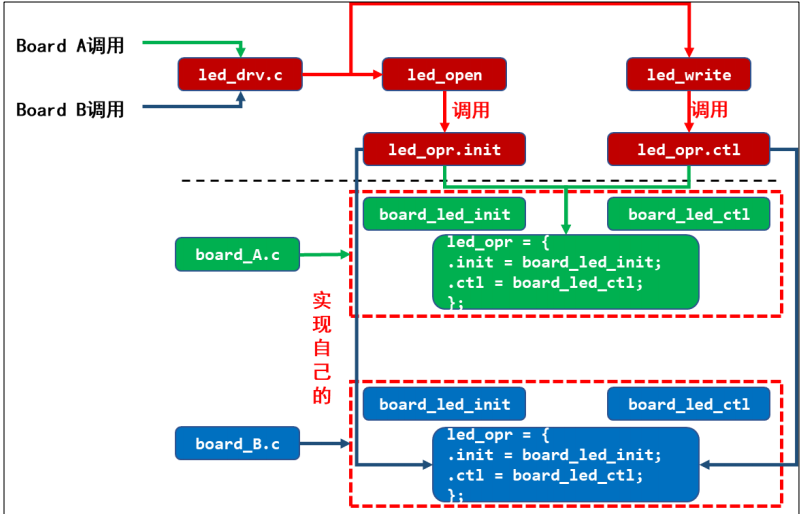

# 驱动开发

## HELLO驱动（第一个驱动）

### APP打开的文件在内核中的表示

APP打开的每个文件句柄，在内核中都有一个**struct file**对应


### 写驱动程序

> 驱动程序需要实现 open、read、write、close等操作

1. 确定主设备号，或者让内核分配
2. 定义自己的 `file_operations` 结构体
3. 实现对应的 `drv_open/drv_read/drv_write` 等函数，填入 `file_operations` 结构体
4. 把 `file_operations` 结构体告诉内核：`register_chrdev`
5. 谁来注册驱动程序啊？得有一个入口函数：安装驱动程序时，就会去调用这个入口函数
6. 有入口函数就应该有出口函数：卸载驱动程序时，出口函数调用`unregister_chrdev`
7. 其他完善：提供设备信息，自动创建设备节点：`class_create`,`device_create`

## 硬件：LED原理

原理：发光二极管导通

需要一定的电压或者电流，有的芯片gpio驱动能力不足（输出电流或者电压不够），需要借助三极管放大就可以只关心输出的是逻辑0还是逻辑1；


## 普适GPIO引脚操作

1. 使能电源、时钟
2. 选择引脚的模式GPIO或者其他
3. 选择输入还是输出方向
4. 数据

**寄存器操作原则：不能影响到其他位** 可以先取出值，对值操作，再赋值给寄存器；或者通过set或者clear寄存器操作对应寄存器

## 具体的gpio引脚操作——6ULL


CCM：时钟控制寄存器 

IOMUXC：引脚模式选择寄存器

GPIO: GPIO内部寄存器 方向 中断 值

## LED驱动程序

- 字符驱动程序框架

    

- 驱动怎么操作硬件？

  通过 ioremap 映射寄存器的物理地址得到虚拟地址，读写虚拟地址。

- 驱动怎么和 APP 传输数据？

  通过 copy_to_user、copy_from_user 这 2 个函数。  

## LED驱动程序框架

分层：上下分层，上层实现硬件无关的操作（leddrv.c），如注册驱动；下层实现硬件相关操作，如实现LED操作

把驱动分为 通用框架和具体的硬件操作，通过链接对应的板子函数（board.c 针对板子），选择对应的板子。



通过文件得到次设备号，用次设备号分辨用哪盏灯

## LED  具体板子的LED驱动程序

需要将寄存器地址映射到虚拟地址，然后对虚拟地址进行操作

```c
#include <asm/io.h>
void __iomem *ioremap(resource_size_t res_cookie, size_t size);
/* 把物理地址 phys_addr 开始的一段空间(大小为 size)，映射为虚拟地址
返回值是该段虚拟地址的首地址。 */
//按页取整
void iounmap(volatile void __iomem *cookie);//不需要时释放
```

```c
static volatile unsigned int *CCM_CCGR1;    //避免被编译器优化
CCM_CCGR1 = ioremap(0x20C406C, 4);
*CCM_CCGR1 |= (3<<30);
```

## 驱动设计的思想

**分离**：

每款芯片的gpio操作都是类似的，可以针对芯片写通用的硬件操作代码。

chipY_gpio.c，它实现芯片 Y 的 GPIO 操作，适用于芯片 Y 的所有 GPIO 引脚。使用时，我们只需要在 board_A_led.c 中指定使用哪一个引脚即可（定义资源）。


构造file——opreation结构体，结构体成员函数led_drv_open和led_drv_write调用p_led_opr->init（配置成输出引脚）和p_led_opr->ctl（控制电平高低）（p_led_opr由芯片相关代码-chip_demo_gpio.c提供），init函数中会调用get_led_resouce从board.c中获得需要控制的引脚信息(board.c告知具体操作哪些资源引脚）

boardA.c中定义led_resource结构体，通过get_resource函数将资源传递给chipY_gpio.c。


## 驱动进化之路：总线设备驱动模型

### 驱动编写的三种写法

#### 传统写法


使用哪个引脚，怎么操作引脚，都写死在代码中。

最简单，不考虑扩展性，可以快速实现功能。

修改引脚时，需要重新编译。

#### 总线设备驱动模型


引入 platform_device/platform_driver，将“资源”与“驱动”分离开来。

代码稍微复杂，但是易于扩展。

冗余代码太多，修改引脚时设备端的代码需要重新编译。

更换引脚时，led_drv.c 基本不用改，但是需要修改 led_dev.c。

#### 设备树


通过配置文件──设备树来定义“资源”。

代码稍微复杂，但是易于扩展。

无冗余代码，修改引脚时只需要修改 dts 文件并编译得到 dtb 文件，把它传

给内核。

无需重新编译内核/驱动。


### 在linux中实现分离：Bus/Dev/Drv


### 匹配规则

1. 首先比较：platform_device.driver_override 和 platform_driver.driver.name

   可以设置 platform_device 的 driver_override，强制选择某个 platform_driver。

2. 然后： platform_device. name 和 platform_driver.id_table[i].name

   Platform_driver.id_table 是“platform_device_id”指针，表示该 drv 支持若干

   个 device，它里面列出了各个 device 的{.name, .driver_data}，其中的“name”表示该

   drv 支持的设备的名字，driver_data 是些提供给该 device 的私有数据。

3. 最后：platform_device.name 和 platform_driver.driver.name

   platform_driver.id_table 可能为空，

   这时可以根据 platform_driver.driver.name 来寻找同名的 platform_device。

### 常用函数

#### 注册反注册

```c
platform_device_register/ platform_device_unregister
platform_driver_register/ platform_driver_unregister
platform_add_devices // 注册多个 device
```


- EXPORT_SYMBOL 

```c
/*a.c 编译为 a.ko，里面定义了 func_a；如果它想让 b.ko 使用该函数，那
么 a.c 里需要导出此函数(如果 a.c, b.c 都编进内核，则无需导出)：*/
EXPORT_SYMBOL(led_device_create);
//并且，使用时要先加载 a.ko。
```

 platform_device/platform_driver需要匹配

## 设备树

### Devicetree格式：

#### DTS文件的格式

​	布局：

```dts
/dts-v1/; // 表示版本
[memory reservations] // 格式为: /memreserve/ <address> <length>;
/ {
 [property definitions]
 [child nodes]
};
```

node（设备树基本单元）：

```dts
[label:] node-name[@unit-address] {
 [properties definitions]
 [child nodes]
};
```

properties（属性：“name=value”）:

⚫ Property 格式 1:

**[label:] property-name = value;**

⚫ Property 格式 2(没有值):

**[label:] property-name;**

⚫ Property 取值只有 3 种: 

**arrays of cells(1** **个或多个** **32** **位数据****, 64** **位数据使用** **2** **个** **32** **位数据表示****),** 

**string(字符串),** 

**bytestring(1 个或多个字节)**

#### dts文件包含dtsi文件

通用的设备树模板一般命名为xxx.dtsi，i表示include，可以被dts包含，dtsi和dts语法一样

dts可以包含.h头文件，也可以包含dtsi，在.h文件中可以定义一些宏。

#### 常用属性

1. **#address-cells、#size-cells**   

    cell指32位数值，address-cells表示add要用多少32位数表示， size-cells：size 要用多少个 32 位数来表示。

   ```dts
   / {
   #address-cells = <1>;
   #size-cells = <1>;
   memory {
   reg = <0x80000000 0x20000000>;
    };
   };
   ```

2. **compatible**  兼容

3. **status**  状态

4. **reg**    本义寄存器地址，表示空间


通过配置文件──设备树来定义“资源”。

代码稍微复杂，但是易于扩展。

无冗余代码，修改引脚时只需要修改 dts 文件并编译得到 dtb 文件，把它传给内核。

无需重新编译内核/驱动。

三种写驱动程序的方法只是指定”硬件资源“的方式不一样，不涉及核心，核心是file_operation。

在工作中，驱动要求设备节点提供什么，设备树就要按要求提供。

但是，匹配过程要求的东西是固定的：

1. 设备树要有 compatible 属性，它的值是一个字符串

2. platform_driver 中要有 of_match_table，其中一项的.compatible 成员设置

   为一个字符串

   上述 2 个字符串要一致。


## 读取按键值的方式

- 查询
- 中断
- poll/select
- 异步通知signal

## Pinctrl子系统

1. pin controller：

   在芯片手册里你找不到 pin controller，它是一个软件上的概念，你可以

   认为它对应 IOMUX──用来复用引脚，还可以配置引脚(比如上下拉电阻等)。

2. client device

   “客户设备”，谁的客户？Pinctrl 系统的客户，那就是使用 Pinctrl 系统

   的设备，使用引脚的设备。它在设备树里会被定义为一个节点，在节点里声明要

   用哪些引脚。(包含groups、function、state）

   

   

   client device中设备有多个状态，状态对应的引脚和初始化配置/复用可以在pin con里面设置。

   当这个设备处于 default 状态时，pinctrl 子系统会自动根据上述信息把所用引脚复用为 uart0 功能。

   当这这个设备处于 sleep 状态时，pinctrl 子系统会自动根据上述信息把所用引脚配置为高电平。

#### pin contr~用法

不需要手动配置，在系统状态切换会自动配置到default状态或init。系统休眠会自动sleep。

## GPIO子系统

哪组GPIO引脚，哪个GPIO口，配置成什么状态。

dtsi中：

```dts
gpio-controller;
#gpio-cells = <2>;
```

在自己设备节点中使用属性"[<name>-]gpios"


## 基于GPIO子系统的LED驱动程序

只需要编写drv.c函数

先定义platform_driver,再注册入门，出口，

在 probe 函数中：

1. 获得引脚（根据 platform_device 的设备树信息确定 GPIO：gpiod_get）

2. 定义、注册 file_operations。

3. 在 file_operations 中：设置方向、读值/写值（使用 GPIO 子系统的函数操作 GPIO）。

## 异常与中断


arm对中断的处理过程

1. 初始化

2. 执行其他程序

3. 产生中断：按下按键->中断控制器->CPU

4. CPU每执行完一条指令都会检查有无中断/异常产生

5. CPU发现有中断/异常产生，开始处理        ***3、4、5都是硬件做的***

6. 中断处理函数

   软件做的：

   - 保存现场
   - 处理异常
   - 恢复现场


中断属于异常


## linux对中断的处理

1. 进程、线程、中断的核心：栈

   - 线程：调度的单位
   - 进程：资源分配的单位，通信效率高
   - 栈：中断时现场保存的地方

2. linux系统对中断处理的演进

   原则：

   - 不能嵌套
   - 处理越快越好

   要处理的事情过多时，拆成 两部分

   - 上部：紧急的，如清除中断标志，不可打断
   - 下部：不紧急的，可以被中断

   工作队列：

   中断需要做的事情实在太耗时，可以用线程来做，在中断上半部唤醒内核线程，内核线程从工作队列中取出一个一个工作函数来执行，app和中断同时进行。

   中断线程创建：

   直接创建中断线程，一个函数直接完成，不需要和工作队列一样繁琐

   

3. linux中断系统中的重要数据结构

   irq_desc[A]的handle_irq会读取gpio寄存器，再去irq_domain把对应hwirq的对应irq取出，确定是中断B后调用irq_desc[B]的handle_irq，irq_desc[B]的handle_irq会调用每个action链表（外部设备）里面的hanlder和thread_fn（在注册request_irq

   时，内核会注册irqaction结构体），在外设的中断处理函数中会进行判断，如果是他产生的中断则继续执行 

   设备树怎么指定中断，指定parent，指定parent里面用哪个中断号。

   每个模块有自己的irq_domain，里面有ops，ops里面的xlate函数会解析设备树，会把模块里面属性解析出来，ops.map会把hwirq转换为全局的irq（irq会保存在platform_device） ,映射关系会保存在irq_domain里面

   irq_domain保存在irq_data里面，里面还有irq_chip里面有很多函数，包括屏蔽、使能中断等

## 设备树中指定中断

中断控制器GIC （类型 哪个 触发类型）

{compatible

interrupt_contorller

#interupt_cell

}


用户配置 

old{

interrupt_parent=<&..> 哪个中断控制器

interrupts=<><> 那个

}

new{

interrupts-extended = <&intcl 5 1>, <&intc2 1 0>;

&intcl 哪个中断控制器

5 1 哪个中断

}


## 休眠与唤醒

线程/进程上下文可以可以休眠，中断里面不可以休眠 


## poll机制


##  中断下半部


 执行多次上半部中断，可能只执行一次下半部

下半部执行时，中断是使能的，如果再次发生了中断，下半部被打断，先执行硬件中断的处理函数，处理完硬件中断后，如果发现之前已经在处理软件中断，则不开始新的软件中断处理，会恢复原来工作，继续执行。


## 工作队列


创造workqueue同时创造线程


先创建线程再创建结构体


## mmap基础知识

### mmap的原因：

应用程序和驱动程序之间传递数据时，可以通过 read、write 函数进行。这

涉及在用户态 buffer 和内核态 buffer 之间传数据，如下图所示：


应用程序不能直接读写驱动程序中的 buffer，需要在用户态 buffer 和内核态 buffer 之间进行一次数据拷贝。这种方式在数据量比较小时没什么问题；

但是数据量比较大时效率就太低了，改进的方法就是让程序可以直接读写驱动程序中的 buffer，这可以通过

mmap 实现(memory map)，把内核的 buffer 映射到用户态，让 APP 在用户态直接读写。

### 虚拟地址

CPU 发出的地址是虚拟地址，它经过MMU(Memory Manage Unit，内存管理单元)映射到物理地址上，对于不同进程的同一个虚拟地址，MMU 会把它们映射到不同的物理地址。

每一个 APP 在内核里都有一个 tast_struct，这个结构体中保存有内存信息：mm_struct。而虚拟地址、物理地址的映射关系保存在页目录表中，如下图所示


### **ARM** **架构内存映射**

ARM 架构支持一级页表映射，也就是说 MMU 根据 CPU 发来的虚拟地址可以找到第 1 个页表，从第 1 个页表里就可以知道这个虚拟地址对应的物理地址。一级页表里地址映射的最小单位是 1M。

ARM 架构还支持二级页表映射，也就是说 MMU 根据 CPU 发来的虚拟地址先找到第 1 个页表，从第 1 个页表里就可以知道第 2 级页表在哪里；再取出第 2 级页表，从第 2 个页表里才能确定这个虚拟地址对应的物理地址。二级页表地址映射的最小单位有 4K、1K，Linux 使用 4K。


### 给APP新建内存映射的步骤

1. 获得app的虚拟内存空间vm_area_struct
2. 在驱动层获得物理地址
3. 重新建立映射


### cache和buffer


使用 mmap 时，需要有 cache、buffer 的知识。下图是 CPU 和内存之间的关系，有 cache、buffer(写缓冲器)。Cache 是一块高速内存；写缓冲器相当于一个 FIFO，可以把多个写操作集合起来一次写入内存。

程序运行时有“局部性原理”，这又分为时间局部性、空间局部性。

⚫ 时间局部性：

在某个时间点访问了存储器的特定位置，很可能在一小段时间里，会反复地访问这个位置。

⚫ 空间局部性：

访问了存储器的特定位置，很可能在不久的将来访问它附近的位置。而 CPU 的速度非常快，内存的速度相对来说很慢。CPU 要读写比较慢的内存时，怎样可以加快速度？根据“局部性原理”，可以引入 cache。

- 写通(write through)

  程序迅速写进cache然后写进内存 ，速度快，但是效率低，一次只能写很少，适用于只读设备：在读数据时用 cache 加速，基本不需要写。

- 写回(write back) 

  新数据只是写入 cache，不会立刻写入内存，cache 和内存中的数据并不一致。

  新数据写入 cache 时，这一行 cache 被标为“脏”(dirty)；当cache 不够用时，才需要把脏的数据写入内存。适合一般的内存读写

- 不使用 cache 也不使用 buffer，读写时都直达硬件，这适合寄存器的读写。

- 不使用 cache 但是使用 buffer，写数据时会用 buffer 进行优化，可能会有“写合并”，这适合显存的操作。因为对显存很少有读操作，基本都是写操作，而写操作即使被“合并”也没有关系。

- 使用 cache 不使用 buffer，就是“write through”，适用于只读设备：在读数据时用 cache 加速，基本不需要写。

